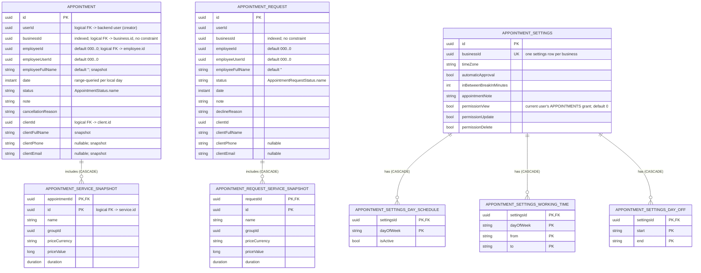

[← Local database ER diagrams](README.md)

# Appointments

Booked appointments, pending appointment requests, and a business's booking settings. Written by
`CommonAppointmentDataSource`, `CommonAppointmentRequestDataSource` and `CommonAppointmentSettingsDataSource`.

These tables have **no foreign key to `business`**. `businessId` is only indexed. Deleting a business row
does not cascade here, and the client/employee references are denormalized snapshot columns.

- **Per-day window.** `appointment` is queried by `[startOfDay, startOfNextDay)` computed in
  `TimeZone.currentSystemDefault()`, which is the *device* zone and not the business `timeZone`. Stale-row
  deletion in [Get appointments for business](../operations/appointments/get-appointments-for-business.md)
  covers only that window. The sync marker is per date:
  `appointments_prefs` / `last_synced_at_<businessId>_<yyyy-MM-dd>`.
- **Requests are stored in every status**, but both `flow()` and `refresh()` of [Get appointment
  requests](../operations/appointments/get-appointment-requests.md) filter to `PENDING` and sort by `date`.
  Sync marker: `appointment_requests_prefs` / `last_synced_at_<businessId>`.
- **Writes:** list refreshes, [Update appointment](../operations/appointments/update-appointment.md)
  (`upsertWithServices` for one row), and [Cancel appointment](../operations/appointments/cancel-appointment.md)
  (`updateStatus`, which the datasource does inside the network call). [Create appointment](../operations/appointments/create-appointment.md)
  and [Approve request](../operations/appointments/approve-appointment-request.md) do **not** write the
  new appointment locally. `AppointmentListViewModel` listens for `AppointmentEvent.Created` and refreshes instead.
  [Get appointment](../operations/appointments/get-appointment.md) reads only from the database (`getById` is
  non-nullable).
- **Settings** are written by [Get appointment settings](../operations/appointments/get-appointment-settings.md)
  `refresh()` and [Update appointment settings](../operations/appointments/update-appointment-settings.md). They have no sync marker, because
  a `null` row is itself unambiguous.
- Cleared on logout: yes, all of them.
