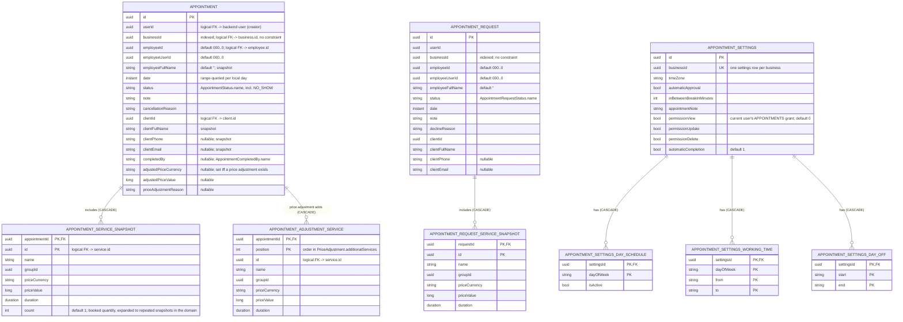

[← Local database ER diagrams](README.md)

# Appointments

Booked appointments, pending appointment requests, and a business's booking settings. Written by
`CommonAppointmentDataSource`, `CommonAppointmentRequestDataSource` and `CommonAppointmentSettingsDataSource`.

These tables have **no foreign key to `business`**. `businessId` is only indexed. Deleting a business row
does not cascade here, and the client/employee references are denormalized snapshot columns.

```mermaid
erDiagram
    APPOINTMENT ||--o{ APPOINTMENT_SERVICE_SNAPSHOT : "includes (CASCADE)"
    APPOINTMENT ||--o{ APPOINTMENT_ADJUSTMENT_SERVICE : "price adjustment adds (CASCADE)"
    APPOINTMENT_REQUEST ||--o{ APPOINTMENT_REQUEST_SERVICE_SNAPSHOT : "includes (CASCADE)"
    APPOINTMENT_SETTINGS ||--o{ APPOINTMENT_SETTINGS_DAY_SCHEDULE : "has (CASCADE)"
    APPOINTMENT_SETTINGS ||--o{ APPOINTMENT_SETTINGS_WORKING_TIME : "has (CASCADE)"
    APPOINTMENT_SETTINGS ||--o{ APPOINTMENT_SETTINGS_DAY_OFF : "has (CASCADE)"

    APPOINTMENT {
        uuid id PK
        uuid userId "logical FK -> backend user (creator)"
        uuid businessId "indexed; logical FK -> business.id, no constraint"
        uuid employeeId "default 000..0; logical FK -> employee.id"
        uuid employeeUserId "default 000..0"
        string employeeFullName "default ''; snapshot"
        instant date "range-queried per local day"
        string status "AppointmentStatus.name, incl. NO_SHOW"
        string note
        string cancellationReason
        uuid clientId "logical FK -> client.id"
        string clientFullName "snapshot"
        string clientPhone "nullable; snapshot"
        string clientEmail "nullable; snapshot"
        string completedBy "nullable; AppointmentCompletedBy.name"
        string adjustedPriceCurrency "nullable; set iff a price adjustment exists"
        long adjustedPriceValue "nullable"
        string priceAdjustmentReason "nullable"
    }

    APPOINTMENT_SERVICE_SNAPSHOT {
        uuid appointmentId PK,FK
        uuid id PK "logical FK -> service.id"
        string name
        uuid groupId
        string priceCurrency
        long priceValue
        duration duration
        int count "default 1; booked quantity, expanded to repeated snapshots in the domain"
    }

    APPOINTMENT_ADJUSTMENT_SERVICE {
        uuid appointmentId PK,FK
        int position PK "order in PriceAdjustment.additionalServices"
        uuid id "logical FK -> service.id"
        string name
        uuid groupId
        string priceCurrency
        long priceValue
        duration duration
    }

    APPOINTMENT_REQUEST {
        uuid id PK
        uuid userId
        uuid businessId "indexed; no constraint"
        uuid employeeId "default 000..0"
        uuid employeeUserId "default 000..0"
        string employeeFullName "default ''"
        string status "AppointmentRequestStatus.name"
        instant date
        string note
        string declineReason
        uuid clientId
        string clientFullName
        string clientPhone "nullable"
        string clientEmail "nullable"
    }

    APPOINTMENT_REQUEST_SERVICE_SNAPSHOT {
        uuid requestId PK,FK
        uuid id PK
        string name
        uuid groupId
        string priceCurrency
        long priceValue
        duration duration
    }

    APPOINTMENT_SETTINGS {
        uuid id PK
        uuid businessId UK "one settings row per business"
        string timeZone
        bool automaticApproval
        int inBetweenBreakInMinutes
        string appointmentNote
        bool permissionView "current user's APPOINTMENTS grant; default 0"
        bool permissionUpdate
        bool permissionDelete
        bool automaticCompletion "default 1"
    }

    APPOINTMENT_SETTINGS_DAY_SCHEDULE {
        uuid settingsId PK,FK
        string dayOfWeek PK
        bool isActive
    }

    APPOINTMENT_SETTINGS_WORKING_TIME {
        uuid settingsId PK,FK
        string dayOfWeek PK
        string from PK
        string to PK
    }

    APPOINTMENT_SETTINGS_DAY_OFF {
        uuid settingsId PK,FK
        string start PK
        string end PK
    }
```

- **Per-day window.** `appointment` is queried by `[startOfDay, startOfNextDay)` computed in
  `TimeZone.currentSystemDefault()`, which is the *device* zone and not the business `timeZone`. Stale-row
  deletion in [Get appointments for business](../operations/appointments/get-appointments-for-business.md)
  covers only that window. The sync marker is per date:
  `appointments_prefs` / `last_synced_at_<businessId>_<yyyy-MM-dd>`.
- **Requests are stored in every status**, but both `flow()` and `refresh()` of [Get appointment
  requests](../operations/appointments/get-appointment-requests.md) filter to `PENDING` and sort by `date`.
  Sync marker: `appointment_requests_prefs` / `last_synced_at_<businessId>`.
- **Repeated services.** The backend stores one `ServiceSnapshot` per booked count. Locally they collapse into one
  `appointment_service_snapshot` row per service id with a `count` (its PK is `(appointmentId, id)`), and
  `AppointmentLocal.toDomain()` expands it again. Without `count`, a service booked twice would come back once,
  and a reschedule built from the cached row would drop the extra booking on the server.
- **Price adjustment** is spread over the nullable `adjusted*`/`priceAdjustmentReason` columns plus
  `appointment_adjustment_service` (ordered by `position`). `adjustedPriceValue`/`adjustedPriceCurrency` being
  non-null is what marks an adjustment as present.
- **Writes:** list refreshes, [Create appointment](../operations/appointments/create-appointment.md),
  [Approve request](../operations/appointments/approve-appointment-request.md),
  [Update appointment](../operations/appointments/update-appointment.md),
  [Cancel appointment](../operations/appointments/cancel-appointment.md),
  [Complete appointment](../operations/appointments/complete-appointment.md) and
  [Mark appointment as no-show](../operations/appointments/mark-appointment-no-show.md)
  (`upsertWithServices` for one row, which also replaces the adjustment services). Every one of these saves the
  server result in a separate datasource call after the network call, so `AppointmentListViewModel` redraws from
  the table.
  [Approve request](../operations/appointments/approve-appointment-request.md) and
  [Decline request](../operations/appointments/decline-appointment-request.md) also delete the handled
  `appointment_request` row (`deleteByIds`), so request `flow()` subscribers drop it at once.
  [Get appointment](../operations/appointments/get-appointment.md) reads only from the database (`getById` is
  non-nullable).
- **Settings** are written by [Get appointment settings](../operations/appointments/get-appointment-settings.md)
  `refresh()` and [Update appointment settings](../operations/appointments/update-appointment-settings.md). They have no sync marker, because
  a `null` row is itself unambiguous.
- Cleared on logout: yes, all of them.
