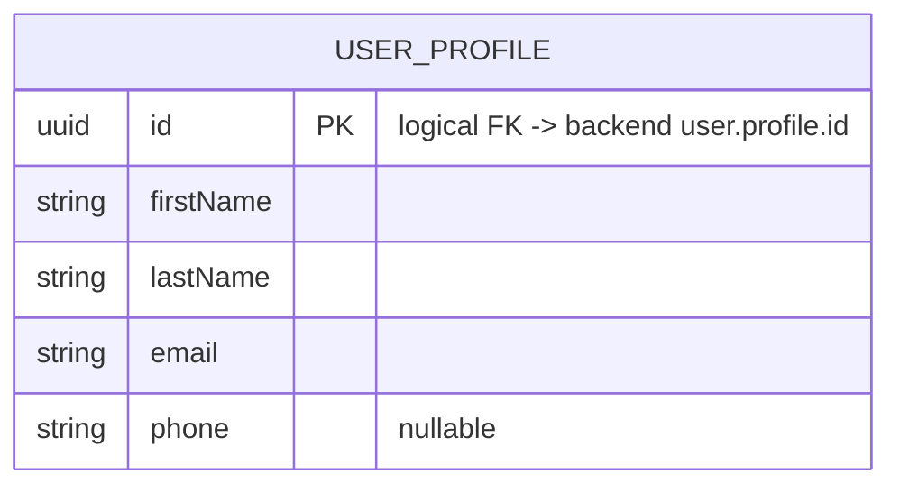

[← Local database ER diagrams](README.md)

# Authorization

The signed-in user's own profile. There is at most one row, because the DAO reads with `limit 1`.
Written by `CommonUserProfileDataSource` and read through `UserProfileCRUD`
([diagram](../operations/authorization/user-profile-crud.md)).

- Written by: `UserProfileCRUD.updateFromRemote()` (via [initial app data fetch](../operations/authorization/initial-app-data-fetch.md)),
  `UserProfileCRUD.get()` on a cache miss, `UserProfileCRUD.update()` ([Edit profile](../operations/settings/edit-profile.md)).
- Read by: [Create appointment](../operations/appointments/create-appointment.md) (the current user becomes
  the assigned employee), [Get settings](../operations/settings/get-settings.md), and
  [Get notification settings](../operations/settings/get-notification-settings.md) (the `flow()` is keyed on `id`).
- Cleared on logout: yes.
