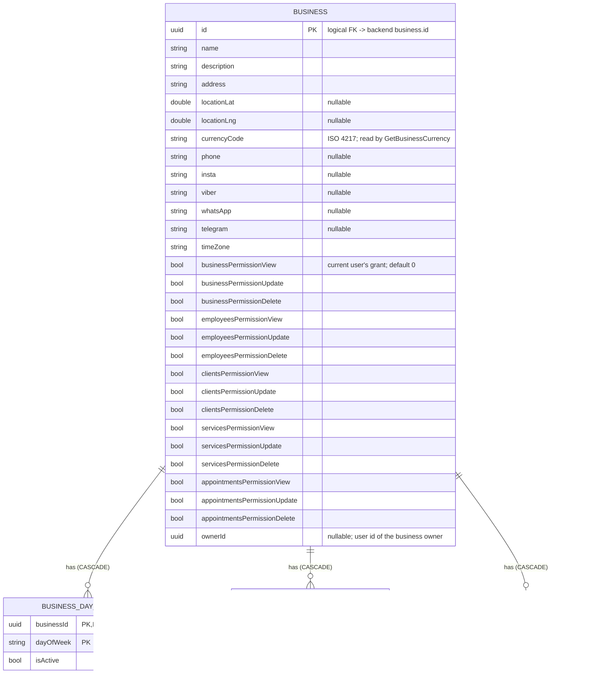

[← Local database ER diagrams](README.md)

# Business

Every business the user owns or works at, including the requesting user's permission grants for each one.
Written by `CommonBusinessDataSource`. The currently selected ("dashboard") business id is **not** stored
here. It lives in the `business_prefs` DataStore bucket (`dashboard_id`, see [preferences](preferences.md)).

`business` is the root of most foreign keys in the database. Deleting a business row cascades to its
schedule tables and to `client`, `employee`, `employee_invitation`, `service` and `service_group`
(see [overview](overview.md)).

- Written by: [Refresh business info](../operations/business/refresh-business-info.md) (`upsertAllWithChildren`
  for the whole list) and [Update business](../operations/business/update-business.md) (`upsertWithChildren` for one).
- Read by: [Observe dashboard business changes](../operations/business/observe-dashboard-business-changes.md)
  (which many features use to scope their lists), [Observe user businesses
  changes](../operations/business/observe-user-businesses-changes.md), [Update business](../operations/business/update-business.md)
  (reads the current row before merging the edit), [Get business currency](../operations/services/get-business-currency.md)
  and [Is business owner](../operations/employees/is-business-owner.md) (compares `ownerId` with an employee's `userId`).
- Cleared on logout: yes (`businessDao.clear()`). Businesses the user has left are not removed by a refresh,
  which only upserts, so they stay until the next logout.
- Migration notes: 15 → 16 added the nullable `business.ownerId` column (auto-migration). Rows cached before
  the migration keep `NULL` until the next [Refresh business info](../operations/business/refresh-business-info.md).
