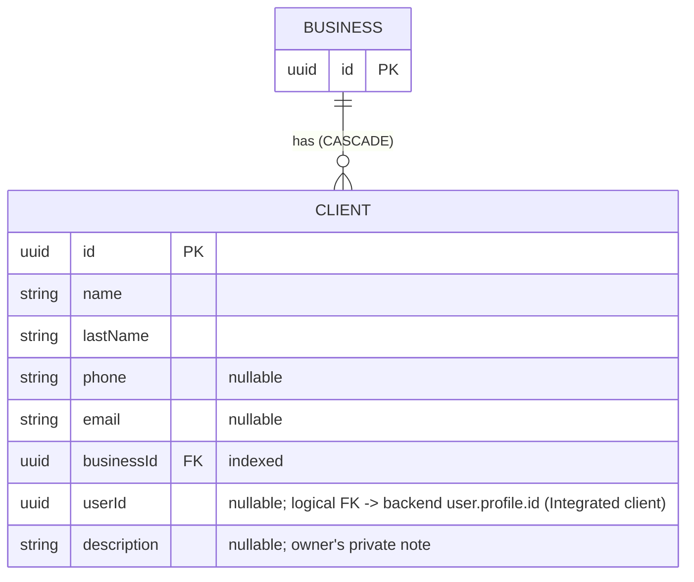

[← Local database ER diagrams](README.md)

# Clients

A business's client list. Written by `CommonClientsDataSource`.

- Written by: [Get clients list](../operations/clients/get-clients-list.md) `refresh()` (stale-id delete and upsert),
  [Create client](../operations/clients/create-client.md), [Edit client](../operations/clients/edit-client.md)
  (upsert one), and [Delete client](../operations/clients/delete-client.md) (`deleteById`).
- Read by: `GetClientsList.flow()` (observes by the dashboard business id) and [Get client](../operations/clients/get-client.md)
  (`getById`, which is **not** nullable, so an unknown id throws).
- Sync marker: `clients_prefs` / `last_synced_at_<businessId>`.
- Cleared on logout: yes.
