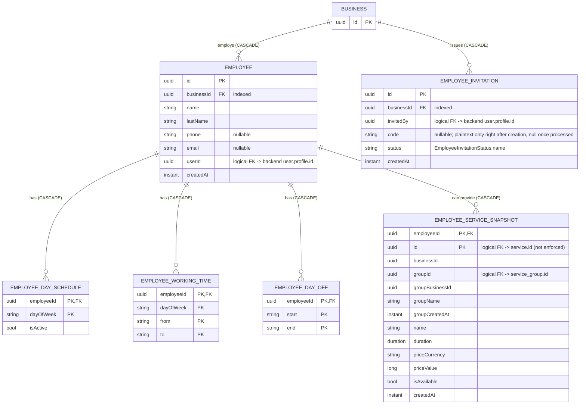

[← Local database ER diagrams](README.md)

# Employees

Staff of a business, including each person's schedule and the services they can provide. Also stores the
invitations the business has issued. Written by `EmployeeDataSourceImpl` and `EmployeeInvitationDataSourceImpl`.

`employee_service_snapshot` is a full copy of the service **and** its group. It deliberately has no foreign key
to `service`, so employees can be cached before services are, or without them.

- Written by: [Get employees](../operations/employees/get-employees.md) `refresh()` (`upsertAllWithChildren`)
  and [Get employee invitations](../operations/employees/get-employee-invitations.md) `refresh()`.
  None of the mutating employee use cases ([Update employee](../operations/employees/update-employee.md),
  [Promote](../operations/employees/promote-employee.md), [Set permission](../operations/employees/set-employee-permission.md),
  [Create](../operations/employees/create-employee-invitation.md) or [Revoke invitation](../operations/employees/revoke-employee-invitation.md))
  writes to the database. The cache only catches up on the next `refresh()`.
- Sync markers: `employees_prefs` and `employee_invitations_prefs` / `last_synced_at_<businessId>`.
- Cleared on logout: yes.
- Migration note: 11 → 12 dropped `employee_invitation.email` (`DeleteEmployeeInvitationEmail` spec).
