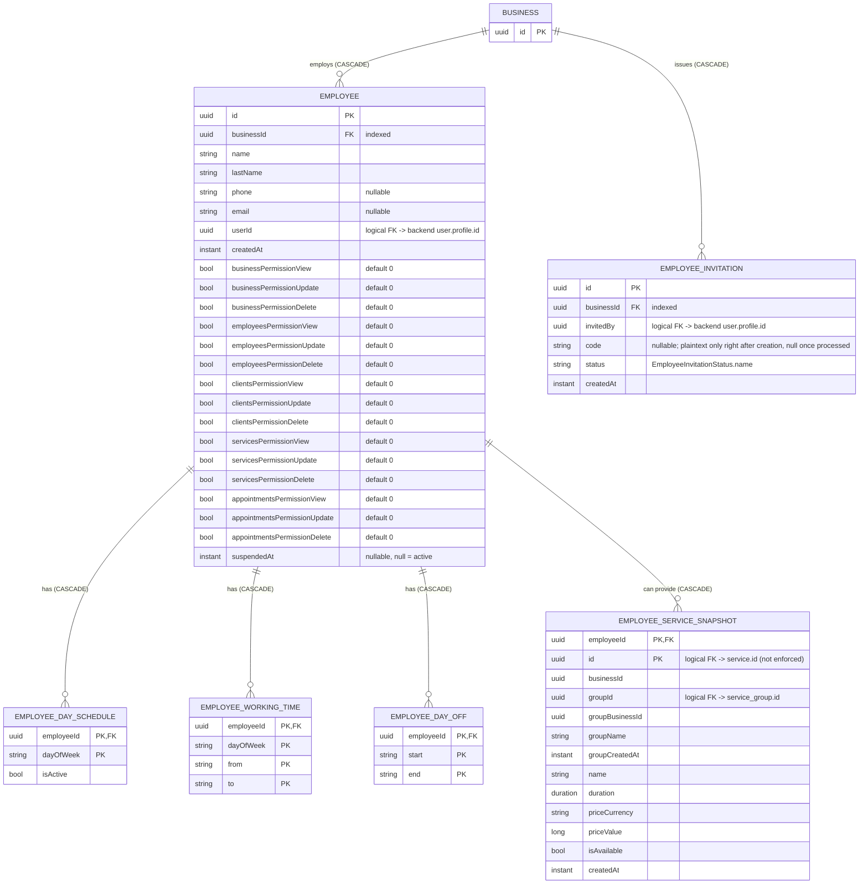

[← Local database ER diagrams](README.md)

# Employees

Staff of a business, including each person's schedule and the services they can provide. Also stores the
invitations the business has issued. Written by `EmployeeDataSourceImpl` and `EmployeeInvitationDataSourceImpl`.

`employee_service_snapshot` is a full copy of the service **and** its group. It deliberately has no foreign key
to `service`, so employees can be cached before services are, or without them.

The `*Permission*` columns flatten the employee's `BusinessPermissions` (view/update/delete per resource), in
the same way as the permission columns on `business`. `suspendedAt` is the moment the owner suspended the
employee, or `null` while the employee is active (`Employee.isSuspended`).

- Written by: [Get employees](../operations/employees/get-employees.md) `refresh()` (`upsertAllWithChildren`),
  [Update employee](../operations/employees/update-employee.md) and
  [Set employee suspension](../operations/employees/set-employee-suspension.md) (both upsert the returned employee) and
  [Get employee invitations](../operations/employees/get-employee-invitations.md) `refresh()`.
  [Create](../operations/employees/create-employee-invitation.md) and [Revoke invitation](../operations/employees/revoke-employee-invitation.md)
  do not write to the database. The invitation cache only catches up on the next `refresh()`.
- Read by id: [Get employee](../operations/employees/get-employee.md) (`employeeDao.getEmployee`).
- Sync markers: `employees_prefs` and `employee_invitations_prefs` / `last_synced_at_<businessId>`.
- Cleared on logout: yes.
- Migration notes: 11 → 12 dropped `employee_invitation.email` (`DeleteEmployeeInvitationEmail` spec).
  14 → 15 added the 15 `employee.*Permission*` columns (auto-migration, all `DEFAULT 0`).
  16 → 17 added the nullable `employee.suspendedAt` column (auto-migration).
