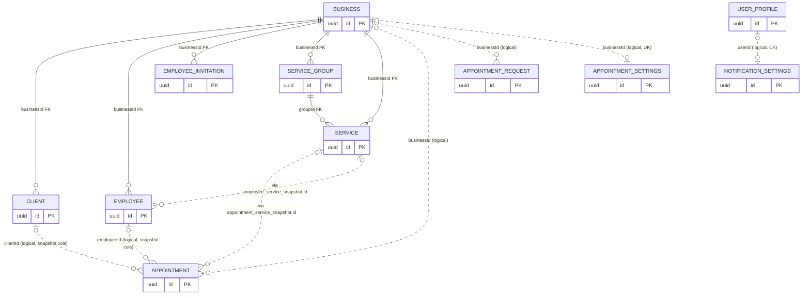

[← Local database ER diagrams](README.md)

# Whole-database overview

Solid lines are **real** SQLite foreign keys, all declared `ON DELETE CASCADE`. Every other reference between
tables is a plain `uuid` column with no constraint, a *logical* reference. Most of these point at
denormalized snapshot data, and the others point at rows that may simply not be cached yet. Child tables of an
aggregate (schedules, snapshots, channels) are omitted here; see each feature's diagram.

## Why some references are logical

- **Appointments and requests** keep the client, employee and services as snapshots taken when the backend
  returned them. A client deleted later should not delete the appointment history, and a price change should not
  rewrite past bookings.
- **The appointment feature is a separately enabled plugin** (see [Enable appointments
  plugin](../operations/business/enable-appointments-plugin.md)). Its tables can be populated for a
  business whose other lists were never fetched.
- **Upsert order is not guaranteed across features.** [Low-priority data fetch](../operations/authorization/initial-app-data-fetch.md)
  refreshes services, groups, clients and employees one after another. A hard FK from, say,
  `employee_service_snapshot` to `service` would make the employee insert fail whenever services had not been
  cached yet.

## Cascade consequences

Deleting one `business` row removes all of its clients, employees (and their schedules/snapshots),
invitations, service groups and services. Its appointments, requests and appointment settings **survive**.
Business rows are deleted only on logout (`businessDao.clear()`), which empties every table anyway. The cascades that do fire in practice are `service_group` → `service`
([Delete service group](../operations/services/delete-service-group.md)) and the parent-to-child aggregate
cascades triggered by the `deleteByIds` stale-row deletion inside each `refresh()`.
