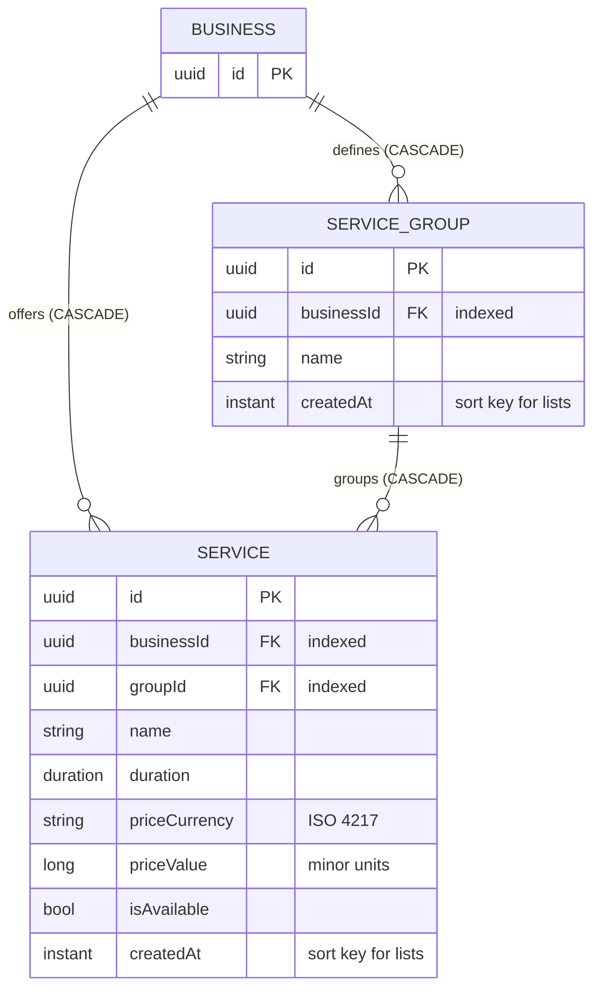

[← Local database ER diagrams](README.md)

# Services

Service groups and the services inside them. `service` is written by `ServiceDataSourceImpl` and
`service_group` by `ServiceGroupDataSourceImpl`. [Get services](../operations/services/get-services.md) also
upserts the groups embedded in each service, so the `service.groupId` foreign key is always satisfied, even
when groups were never fetched on their own.

`ServiceLocal` reads a service row together with its group (`@Relation parentColumn = groupId`).

- Written by: [Get services](../operations/services/get-services.md) and [Get service groups](../operations/services/get-service-groups.md)
  `refresh()`, [Create service](../operations/services/create-service.md), [Edit service](../operations/services/edit-service.md),
  [Delete service](../operations/services/delete-service.md), [Create service group](../operations/services/create-service-group.md),
  and [Delete service group](../operations/services/delete-service-group.md) (the local delete cascades to the group's services).
- Sync markers: `services_prefs` and `service_groups_prefs` / `last_synced_at_<businessId>`.
- Cleared on logout: yes, both tables.
