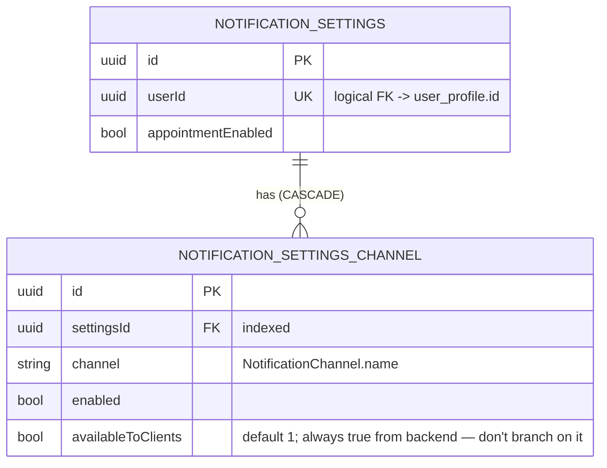

[← Local database ER diagrams](README.md)

# Settings

The user's notification preferences: one settings row per user plus one row per delivery channel.
Written by `CommonNotificationSettingsDataSource`. The color scheme and the pending push token are
key-value data in DataStore, not tables (see [preferences](preferences.md)).

- `availableToClients` is always `true` on the wire. Whether a channel is shown must be decided by whether
  it is **present in the list**, not by this column.
- Written by: [Get notification settings](../operations/settings/get-notification-settings.md) `refresh()`
  and [Update notification settings](../operations/settings/update-notification-settings.md) (`upsertWithChildren`).
- Read by: `GetNotificationSettings.flow()`, keyed on the `user_profile` id, so the flow emits `null` until a
  profile row exists.
- Cleared on logout: yes (`notificationSettingsDao.clear()`).
