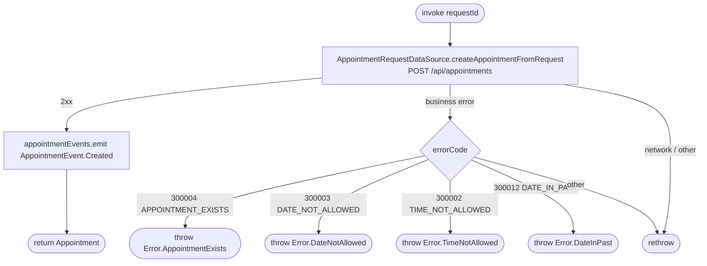

[← Operations](../README.md)

# Approve appointment request

`ApproveAppointmentRequest(requestId)` → `POST /api/appointments` (body `AppointmentRequestIdRemote`)
· called from `AppointmentRequestViewModel`

Turns a pending request into a real appointment on the backend. The new appointment is **not** written to the
local database here. The use case emits `AppointmentEvent.Created`, and `AppointmentListViewModel` reacts by
refreshing the day. `AppointmentRequestViewModel` drops the item from its in-memory list on success. The cached request row
stays `PENDING` until the next [Get appointment requests](get-appointment-requests.md) `refresh()`.
`AppointmentListViewModel.reload()` runs one when it reloads the request count.

**Emits:** `AppointmentEvent.Created`. **Consumed by:** `AppointmentListViewModel.reload()`, which calls
[Get appointments for business](get-appointments-for-business.md) `refresh()` for the selected date and
[Get appointment requests](get-appointment-requests.md) `refresh()`.
