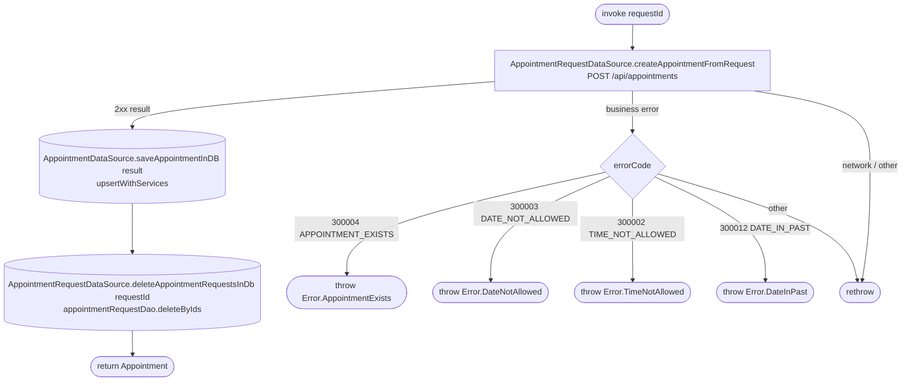

[← Operations](../README.md)

# Approve appointment request

`ApproveAppointmentRequest(requestId)` → `POST /api/appointments` (body `AppointmentRequestIdRemote`)
· called from `AppointmentRequestViewModel`

Turns a pending request into a real appointment on the backend. The new appointment is saved to the
`appointment` table, and the approved `appointment_request` row is deleted, each in its own datasource call.
`AppointmentListViewModel` redraws the day and the request count from those tables.

```mermaid
flowchart TD
    Start([invoke requestId]) --> Net[AppointmentRequestDataSource.createAppointmentFromRequest<br/>POST /api/appointments]
    Net -- 2xx result --> Save[(AppointmentDataSource.saveAppointmentInDB result<br/>upsertWithServices)]
    Save --> Del[(AppointmentRequestDataSource.deleteAppointmentRequestsInDb requestId<br/>appointmentRequestDao.deleteByIds)]
    Del --> R([return Appointment])
    Net -- business error --> Code{errorCode}
    Code -- 300004 APPOINTMENT_EXISTS --> E1([throw Error.AppointmentExists])
    Code -- 300003 DATE_NOT_ALLOWED --> E2([throw Error.DateNotAllowed])
    Code -- 300002 TIME_NOT_ALLOWED --> E3([throw Error.TimeNotAllowed])
    Code -- 300012 DATE_IN_PAST --> E4([throw Error.DateInPast])
    Code -- other --> EX([rethrow])
    Net -- network / other --> EX
```
