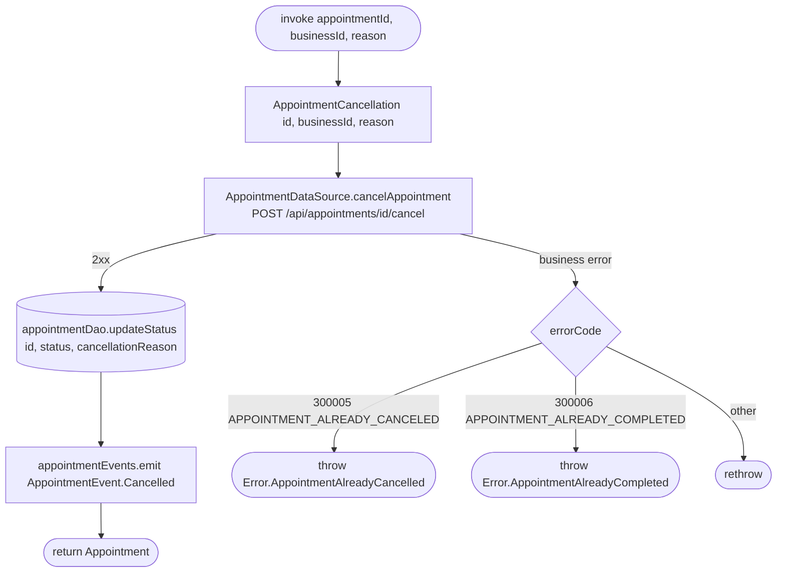

[← Operations](../README.md)

# Cancel appointment

`CancelAppointment(appointmentId, businessId, reason)` → `POST /api/appointments/{id}/cancel`
· called from `AppointmentDetailsViewModel`

The local status update happens **inside the datasource's network method**
(`CommonAppointmentDataSource.cancelAppointment` calls `appointmentDao.updateStatus` after decoding the
response). This is the one exception to the rule that a datasource method either fetches or writes, never both.
Only `status` and `cancellationReason` are patched, and the service snapshot is untouched.

**Emits:** `AppointmentEvent.Cancelled`. **Consumed by:** nobody at the moment. The list screen redraws
because it observes the `appointment` table.
