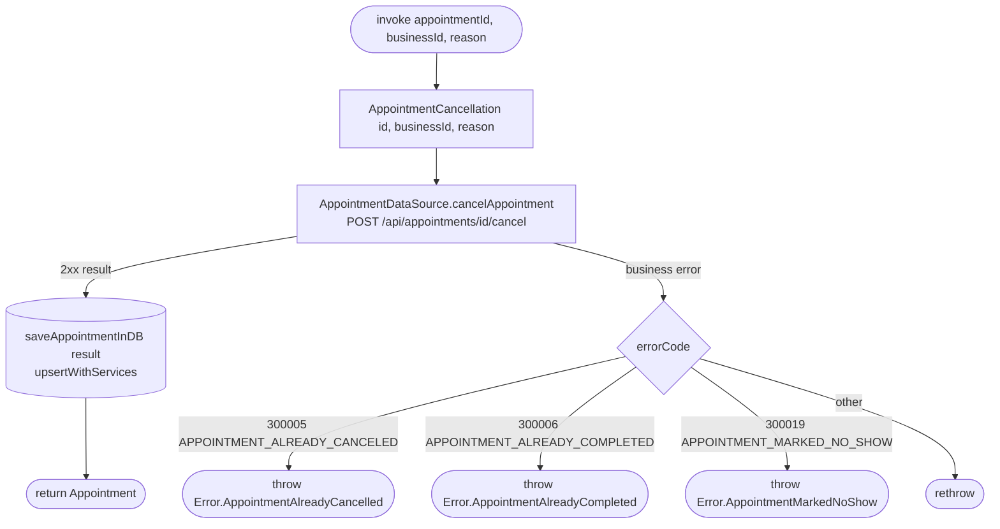

[← Operations](../README.md)

# Cancel appointment

`CancelAppointment(appointmentId, businessId, reason)` → `POST /api/appointments/{id}/cancel`
· called from `AppointmentDetailsViewModel`

The network call and the DB write are separate datasource methods, and the use case runs them in order. The
server result is saved with `upsertWithServices`, the same as in [Complete appointment](complete-appointment.md).

```mermaid
flowchart TD
    Start([invoke appointmentId, businessId, reason]) --> Build[AppointmentCancellation id, businessId, reason]
    Build --> Net[AppointmentDataSource.cancelAppointment<br/>POST /api/appointments/id/cancel]
    Net -- 2xx result --> DB[(saveAppointmentInDB result<br/>upsertWithServices)]
    DB --> R([return Appointment])
    Net -- business error --> Code{errorCode}
    Code -- 300005 APPOINTMENT_ALREADY_CANCELED --> E1([throw Error.AppointmentAlreadyCancelled])
    Code -- 300006 APPOINTMENT_ALREADY_COMPLETED --> E2([throw Error.AppointmentAlreadyCompleted])
    Code -- 300019 APPOINTMENT_MARKED_NO_SHOW --> E3([throw Error.AppointmentMarkedNoShow])
    Code -- other --> EX([rethrow])
```
