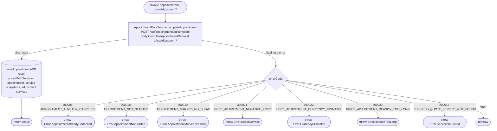

[← Operations](../README.md)

# Complete appointment

`CompleteAppointment(appointmentId, priceAdjustment = null)` → `POST /api/appointments/{id}/complete`
· called from `AppointmentDetailsViewModel` (the "Mark as completed" button)

Marks a **started** `SCHEDULED` appointment as `COMPLETED` with `completedBy = USER`. The backend treats an
already-completed appointment as a no-op and keeps its status and completer. The optional
`PriceAdjustmentDraft` (final charged price, extra catalog service ids, optional reason) is sent as
`CompleteAppointmentRequest.priceAdjustment` and replaces any earlier adjustment. The details screen
currently always sends `null`.

The network call and the DB write are separate datasource methods, and the use case runs them in order. The
server result is saved with `upsertWithServices`, which also rewrites the `appointment_adjustment_service` rows.

The details screen shows the button only when `Appointment.canBeCompleted()` is true (`SCHEDULED` and
`date <= now`), which mirrors the backend's `requireCompletable` guard.
