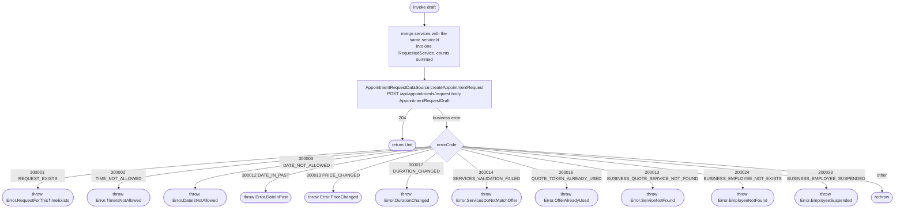

[← Operations](../README.md)

# Create appointment request

`CreateAppointmentRequest(draft)` → `POST /api/appointments/request`
· not called from any screen yet (no client-side booking flow exists)

A client asks a business for a slot. The `AppointmentRequestDraft` carries only ids and the slot:
`businessId` (#1), `employeeId` (#2), `services` (#3) as `RequestedService(serviceId, count)`, `date` (#4),
`note` (#5) and `offerToken` (#6). The token is the signed quote that `CreateQuote`
(`POST /api/business/{businessId}/service/quote`) returns, and it freezes the price and duration the client
saw. The backend resolves employee, client and services itself and attaches the request to the caller.

The backend rejects the same `serviceId` appearing in two entries, so the use case first merges such entries
into a single count, in first-booked order. The response is `204` with no body. Nothing is written locally,
since the request belongs to the business's request list and not the client's.

`PriceChanged`, `DurationChanged` and `OfferAlreadyUsed` mean the quote is stale or spent: request a new
quote and resubmit. The backend releases the token again on every other failure, so retrying with the same
token after fixing the slot is fine.
