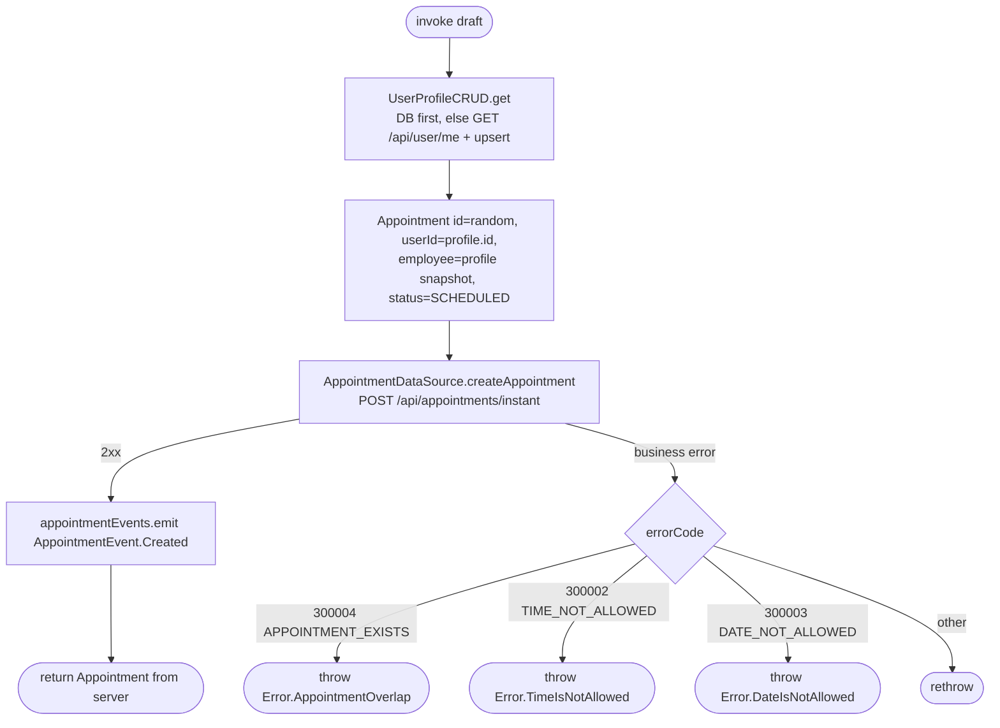

[← Operations](../README.md)

# Create appointment (instant)

`CreateAppointment(draft)` → `POST /api/appointments/instant`
· called from `AppointmentCreateViewModel` and `AppointmentListViewModel`

The id is generated on the client with `Uuid.random()`. The **current user is always the assigned employee**:
`employee.id` and `employee.userId` are both set to the profile id, which the server resolves to the employee
record. The result is not saved locally, and the list refreshes through the event instead.

Depends on [User profile CRUD](../authorization/user-profile-crud.md).
**Emits:** `AppointmentEvent.Created`. **Consumed by:** `AppointmentListViewModel.reload()`, which refreshes the currently selected date and the request count.
