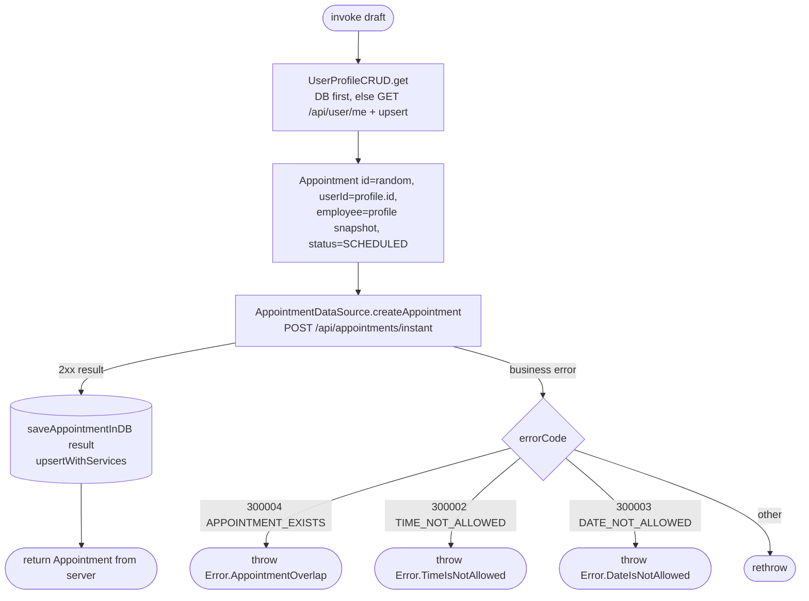

[← Operations](../README.md)

# Create appointment (instant)

`CreateAppointment(draft)` → `POST /api/appointments/instant`
· called from `AppointmentCreateViewModel` and `AppointmentListViewModel`

The id is generated on the client with `Uuid.random()`. The **current user is always the assigned employee**:
`employee.id` and `employee.userId` are both set to the profile id, which the server resolves to the employee
record. The server result is saved with `saveAppointmentInDB` in a separate datasource call, so the list screen
redraws from the `appointment` table.

```mermaid
flowchart TD
    Start([invoke draft]) --> Profile[UserProfileCRUD.get<br/>DB first, else GET /api/user/me + upsert]
    Profile --> Build[Appointment id=random, userId=profile.id,<br/>employee=profile snapshot, status=SCHEDULED]
    Build --> Net[AppointmentDataSource.createAppointment<br/>POST /api/appointments/instant]
    Net -- 2xx result --> Save[(saveAppointmentInDB result<br/>upsertWithServices)]
    Save --> R([return Appointment from server])
    Net -- business error --> Code{errorCode}
    Code -- 300004 APPOINTMENT_EXISTS --> E1([throw Error.AppointmentOverlap])
    Code -- 300002 TIME_NOT_ALLOWED --> E2([throw Error.TimeIsNotAllowed])
    Code -- 300003 DATE_NOT_ALLOWED --> E3([throw Error.DateIsNotAllowed])
    Code -- other --> EX([rethrow])
```

Depends on [User profile CRUD](../authorization/user-profile-crud.md).
