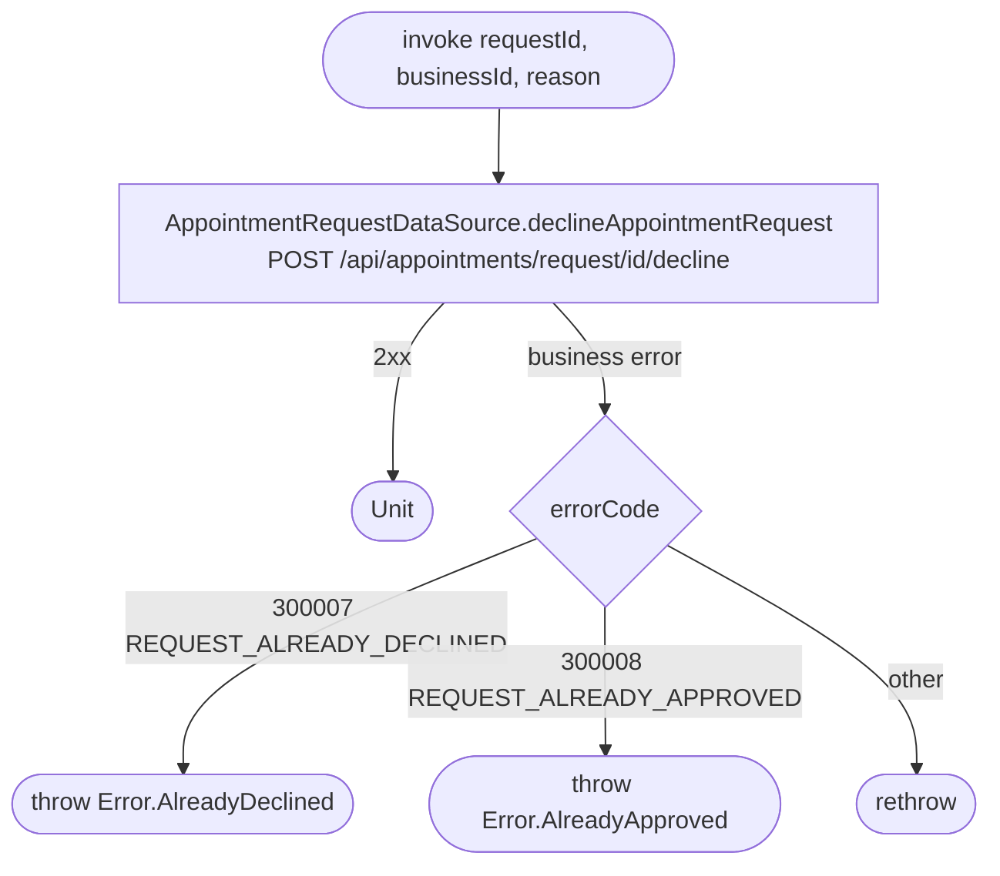

[← Operations](../README.md)

# Decline appointment request

`DeclineAppointmentRequest(requestId, businessId, reason)` → `POST /api/appointments/request/{id}/decline`
· called from `AppointmentRequestViewModel`

Network only. It neither writes to the database nor emits an event. On success, `AppointmentRequestViewModel`
removes the row from its in-memory list state. The cached `appointment_request` row keeps its old `PENDING`
status until the next [Get appointment requests](get-appointment-requests.md) `refresh()`. Until then, any
`flow()` subscriber still sees it as pending.

