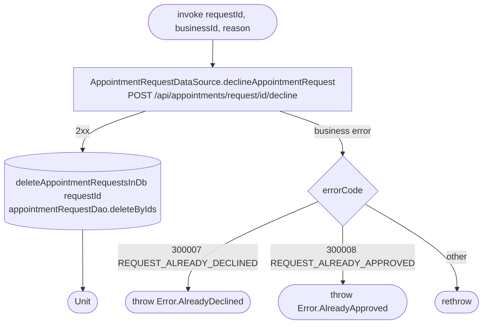

[← Operations](../README.md)

# Decline appointment request

`DeclineAppointmentRequest(requestId, businessId, reason)` → `POST /api/appointments/request/{id}/decline`
· called from `AppointmentRequestViewModel`

After the network call succeeds, the declined `appointment_request` row is deleted in a separate datasource
call, so every [Get appointment requests](get-appointment-requests.md) `flow()` subscriber (the requests list
and the request count on the appointment list) drops it at once.

```mermaid
flowchart TD
    Start([invoke requestId, businessId, reason]) --> Net[AppointmentRequestDataSource.declineAppointmentRequest<br/>POST /api/appointments/request/id/decline]
    Net -- 2xx --> Del[(deleteAppointmentRequestsInDb requestId<br/>appointmentRequestDao.deleteByIds)]
    Del --> R([Unit])
    Net -- business error --> Code{errorCode}
    Code -- 300007 REQUEST_ALREADY_DECLINED --> E1([throw Error.AlreadyDeclined])
    Code -- 300008 REQUEST_ALREADY_APPROVED --> E2([throw Error.AlreadyApproved])
    Code -- other --> EX([rethrow])
```
