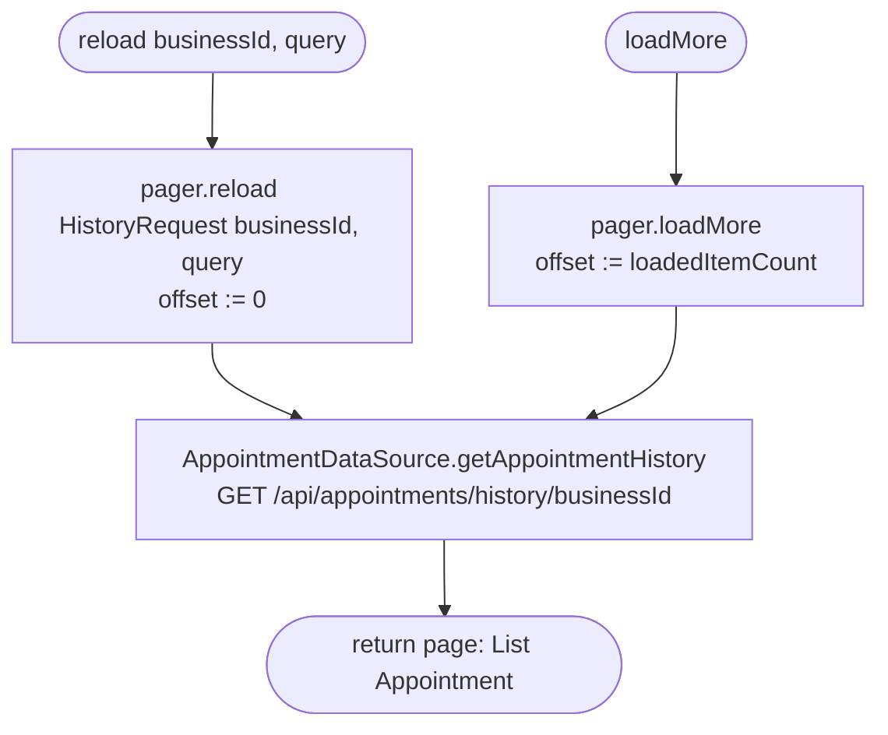

[← Operations](../README.md)

# Get appointment history (paged)

`GetAppointmentHistory.reload(businessId, query?)` / `.loadMore()` →
`GET /api/appointments/history/{businessId}?limit=20&offset=N&query=…`
· called from `AppointmentHistoryViewModel`

Network only, with nothing cached. It is backed by a `CounterPager` with a page size of 20. `reload` resets the
pager to offset 0 with a new `(businessId, query)` request, and `loadMore` requests the next page using
`offset = loadedItemCount`. The pager is held inside the use case instance (Koin `factory`), so the state
belongs to the view model that injected it.

