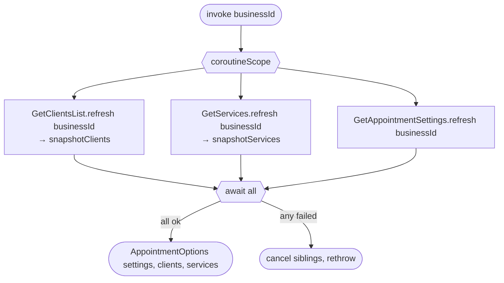

[← Operations](../README.md)

# Get appointment options

`GetAppointmentOptions(businessId)` → composes three other use cases' `refresh()`
· called from `AppointmentCreateViewModel`

Loads everything the create-appointment form needs **in parallel** (`coroutineScope` + three `async`), then
maps clients and services down to the snapshot types an appointment stores. Each branch is a full
network refresh that also rewrites its cache table. If any branch fails, the scope cancels the other two and
rethrows.

Composes [Get clients list](../clients/get-clients-list.md), [Get services](../services/get-services.md) and
[Get appointment settings](get-appointment-settings.md).
