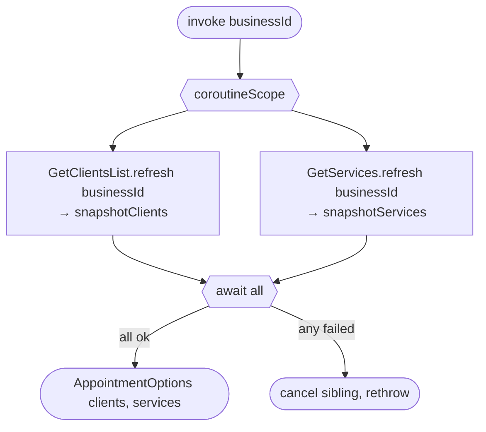

[← Operations](../README.md)

# Get appointment options

`GetAppointmentOptions(businessId)` → composes two other use cases' `refresh()`
· called from `AppointmentCreateViewModel` on start

Refreshes the clients and services the create-appointment form offers **in parallel** (`coroutineScope` + two
`async`), then maps them down to the snapshot types an appointment stores. Each branch is a full network
refresh that also rewrites its cache table, so [Observe appointment options](observe-appointment-options.md)
re-emits the fresh lists. The screen renders from that flow, not from this result. If either branch fails, the
scope cancels the other and rethrows.

```mermaid
flowchart TD
    Start([invoke businessId]) --> Fork{{coroutineScope}}
    Fork --> C[GetClientsList.refresh businessId<br/>→ snapshotClients]
    Fork --> S[GetServices.refresh businessId<br/>→ snapshotServices]
    C --> Join{{await all}}
    S --> Join
    Join -- all ok --> R([AppointmentOptions clients, services])
    Join -- any failed --> EX([cancel sibling, rethrow])
```

Composes [Get clients list](../clients/get-clients-list.md) and [Get services](../services/get-services.md).
