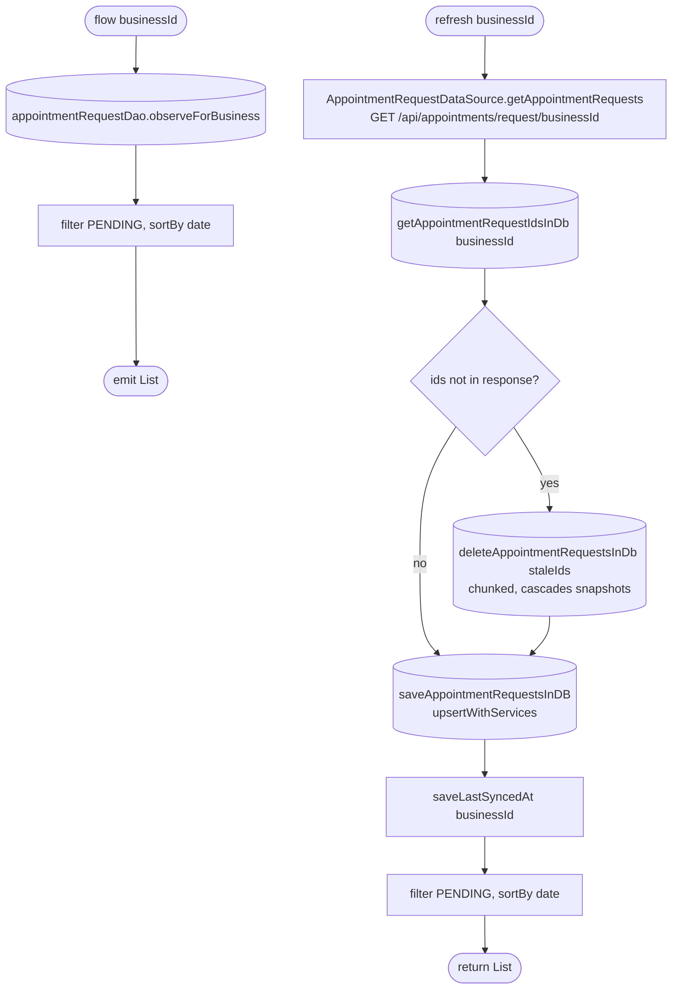

[← Operations](../README.md)

# Get appointment requests

`GetAppointmentRequests.flow(businessId)` / `.refresh(businessId)` → `GET /api/appointments/request/{businessId}`
· called from `AppointmentListViewModel` and `AppointmentRequestViewModel`

Requests are cached in **every** status, but both paths return only `PENDING` requests, sorted by `date`.

