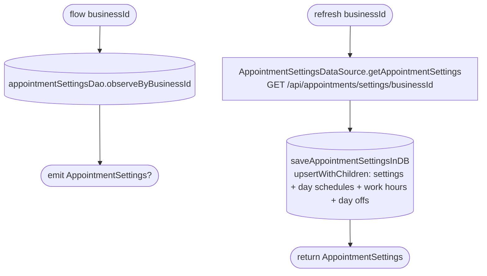

[← Operations](../README.md)

# Get appointment settings

`GetAppointmentSettings.flow(businessId)` / `.refresh(businessId)` → `GET /api/appointments/settings/{businessId}`
· called from `AppointmentSettingsViewModel`, [Get appointment options](get-appointment-options.md),
and [low-priority data fetch](../authorization/initial-app-data-fetch.md)

A single row per business, so there is no stale-id deletion and no sync marker (a `null` flow emission means
"not cached yet").

