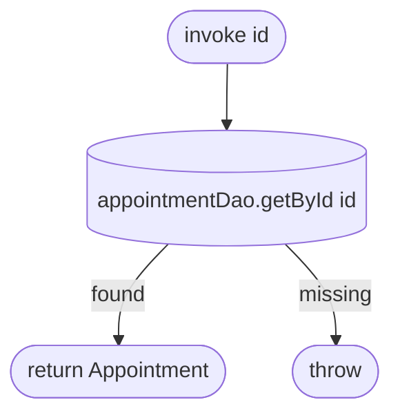

[← Operations](../README.md)

# Get appointment

`GetAppointment(id)` → **local only**, `appointmentDao.getById(id)`
· called from `AppointmentDetailsViewModel`

Reads a single appointment and its service snapshots from Room. There is no network fallback. The details
screen is only reachable from a list that has already cached the row. `getById` returns a non-null
`AppointmentLocal`, so an id that is not in the cache throws.

