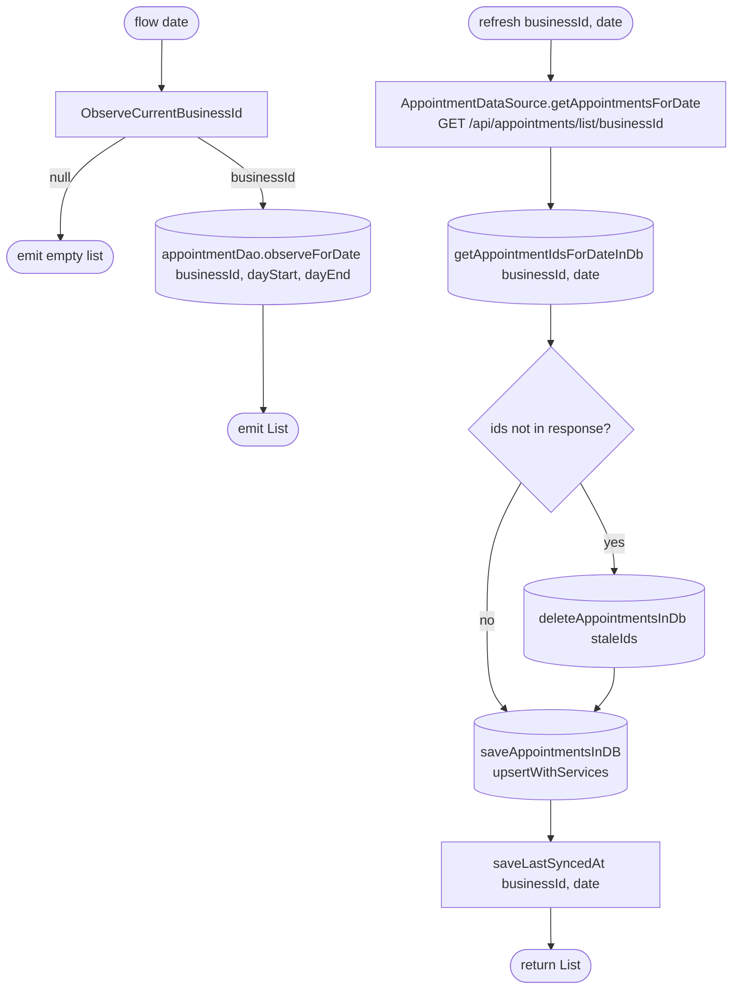

[← Operations](../README.md)

# Get appointments for business (per day)

`GetAppointmentsForBusiness.flow(date)` / `.refresh(businessId, date)` →
`GET /api/appointments/list/{businessId}?date=yyyy-MM-dd`
· called from `AppointmentListViewModel`

`flow` follows the dashboard business: it switches to the new business's rows whenever the selection changes,
and emits `[]` while no business is selected. The day window is `[startOfDay, startOfNextDay)` in the
**device** time zone. Stale-row deletion only covers that window, so appointments on other days are never
touched.

Depends on [Observe current business id](../business/observe-dashboard-business-changes.md).
