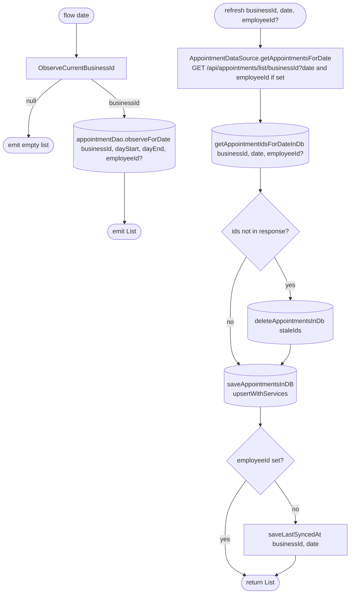

[← Operations](../README.md)

# Get appointments for business (per day)

`GetAppointmentsForBusiness.flow(date, employeeId = null)` / `.refresh(businessId, date, employeeId = null)` →
`GET /api/appointments/list/{businessId}?date=yyyy-MM-dd[&employeeId=]`
· called from `AppointmentListViewModel`

`flow` follows the dashboard business: it switches to the new business's rows whenever the selection changes,
and emits `[]` while no business is selected. The day window is `[startOfDay, startOfNextDay)` in the
**device** time zone. Stale-row deletion only covers that window, so appointments on other days are never
touched.

`employeeId` (an employee record id, matched against `appointment.employeeId`) narrows the request to one
employee. The same filter is applied to the Room observation and to the stale-id lookup, so a filtered refresh
only prunes that employee's rows and never deletes other employees' cached appointments for the day. Only an
unfiltered refresh writes the per-day sync marker, because a filtered one does not cover the whole day. No
screen passes an employee yet.

```mermaid
flowchart TD
    F([flow date]) --> Cur[ObserveCurrentBusinessId]
    Cur -- null --> Empty([emit empty list])
    Cur -- businessId --> Obs[(appointmentDao.observeForDate businessId, dayStart, dayEnd, employeeId?)]
    Obs --> FR([emit List])

    R([refresh businessId, date, employeeId?]) --> Net[AppointmentDataSource.getAppointmentsForDate<br/>GET /api/appointments/list/businessId?date and employeeId if set]
    Net --> Ids[(getAppointmentIdsForDateInDb businessId, date, employeeId?)]
    Ids --> Stale{ids not in response?}
    Stale -- yes --> Del[(deleteAppointmentsInDb staleIds)]
    Stale -- no --> Save
    Del --> Save[(saveAppointmentsInDB<br/>upsertWithServices)]
    Save --> Filtered{employeeId set?}
    Filtered -- no --> Mark[saveLastSyncedAt businessId, date]
    Filtered -- yes --> RR
    Mark --> RR([return List])
```

Depends on [Observe current business id](../business/observe-dashboard-business-changes.md).
