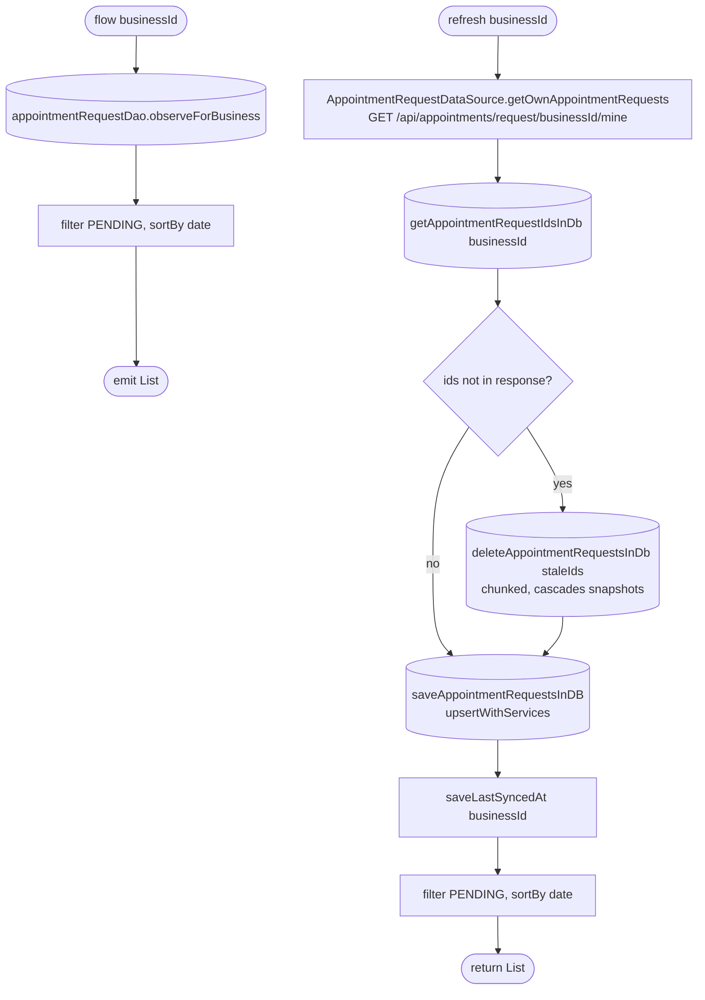

[← Operations](../README.md)

# Get own appointment requests

`GetOwnAppointmentRequests.flow(businessId)` / `.refresh(businessId)` → `GET /api/appointments/request/{businessId}/mine`
· called from `AppointmentListViewModel` (request count) and `AppointmentRequestViewModel` (requests list)

The route returns only the caller's own `PENDING` requests in the business and needs no appointments `view`
permission. The business-wide `GET /api/appointments/request/{businessId}` is not used by the app, so
`appointment_request` only ever holds the signed-in user's requests and the stale-row cleanup below cannot
remove anything else. Both paths still filter to `PENDING` and sort by `date`, so a row whose status changed
locally drops out at once.

