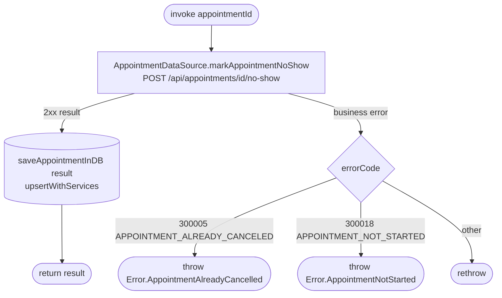

[← Operations](../README.md)

# Mark appointment as no-show

`MarkAppointmentNoShow(appointmentId)` → `POST /api/appointments/{id}/no-show`
· called from `AppointmentDetailsViewModel` (the "Client didn't show up" button, after a confirmation dialog)

Marks a **started** `SCHEDULED` or `COMPLETED` appointment as `NO_SHOW`. The backend treats an
appointment that is already `NO_SHOW` as a no-op. No request body.

The details screen shows the button only when `Appointment.canBeMarkedNoShow()` is true (`SCHEDULED` or
`COMPLETED`, and `date <= now`), which mirrors the backend's `requireNoShowMarkable` guard.
