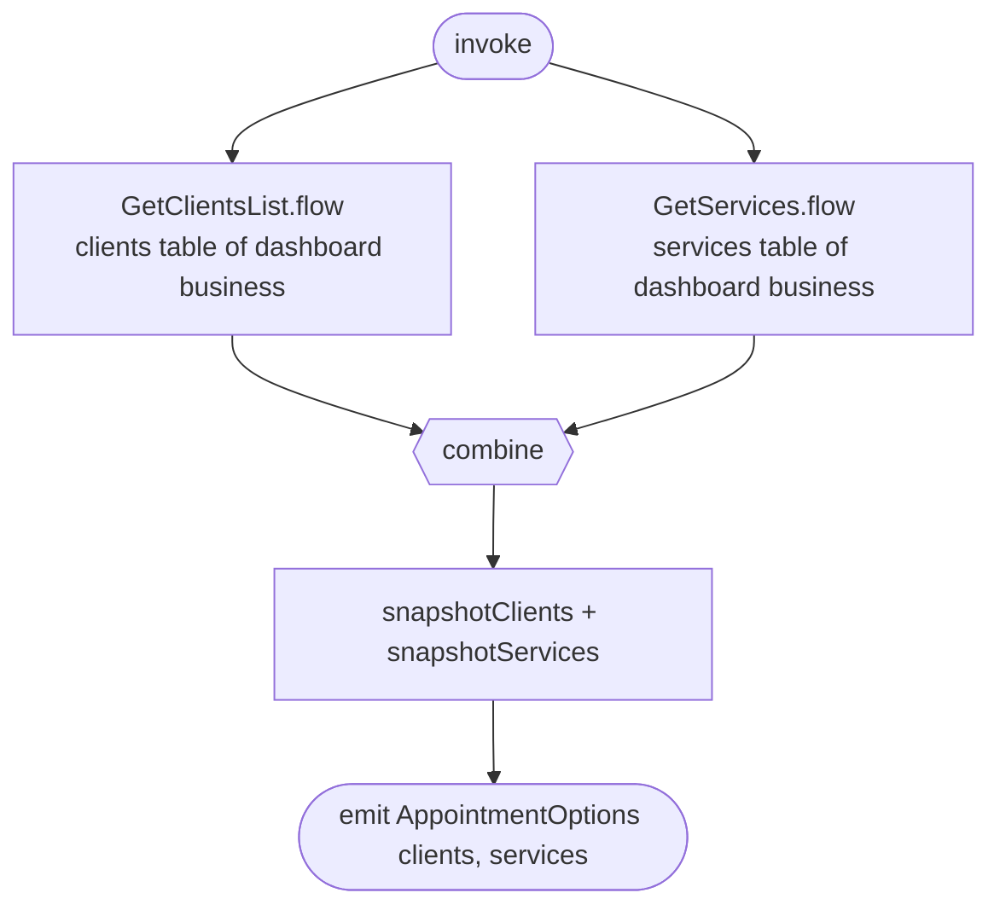

[← Operations](../README.md)

# Observe appointment options

`ObserveAppointmentOptions()` → `Flow<AppointmentOptions>`, **local only**
· called from `AppointmentCreateViewModel`

Feeds the client and service pickers on the create-appointment form. It combines the cached clients and services
of the dashboard business and re-emits whenever either table changes. That includes the refresh
[Get appointment options](get-appointment-options.md) runs on start, and clients or services created while the
form is open. No network calls.

Composes [Get clients list](../clients/get-clients-list.md) and [Get services](../services/get-services.md).
