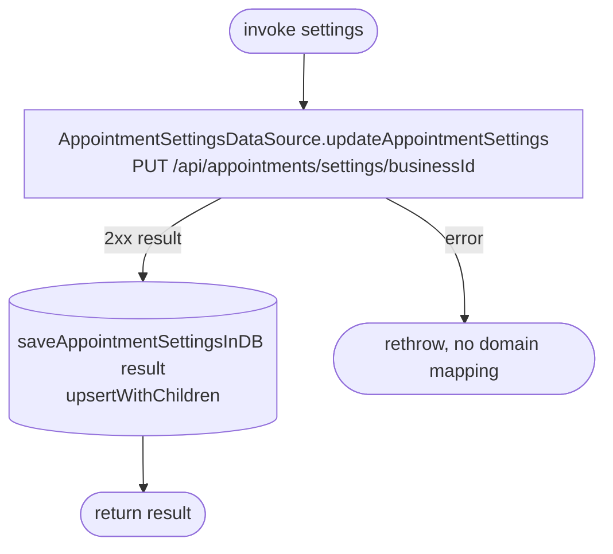

[← Operations](../README.md)

# Update appointment settings

`UpdateAppointmentSettings(settings)` → `PUT /api/appointments/settings/{businessId}`
· called from `AppointmentSettingsViewModel`

Server-first: the database is only written with the server's response, never with the submitted value.

