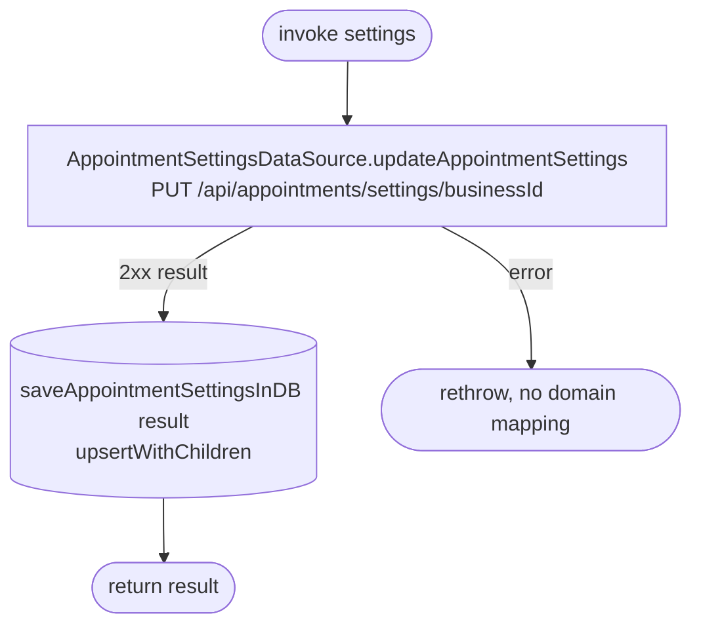

[← Operations](../README.md)

# Update appointment settings

`UpdateAppointmentSettings(settings)` → `PUT /api/appointments/settings/{businessId}`
· called from `AppointmentSettingsViewModel`

Server-first: the database is only written with the server's response, never with the submitted value.

The body is `AppointmentSettingsUpdate(businessId, automaticApproval, inBetweenBreakInMinutes,
appointmentNote, automaticCompletion?)`. `automaticCompletion` (#5) is nullable on the wire, and the
backend keeps the stored value when it is omitted. The client always sends the toggle's value.

```mermaid
flowchart TD
    Start([invoke settings]) --> Net[AppointmentSettingsDataSource.updateAppointmentSettings<br/>PUT /api/appointments/settings/businessId]
    Net -- 2xx result --> Save[(saveAppointmentSettingsInDB result<br/>upsertWithChildren)]
    Save --> R([return result])
    Net -- error --> EX([rethrow, no domain mapping])
```
