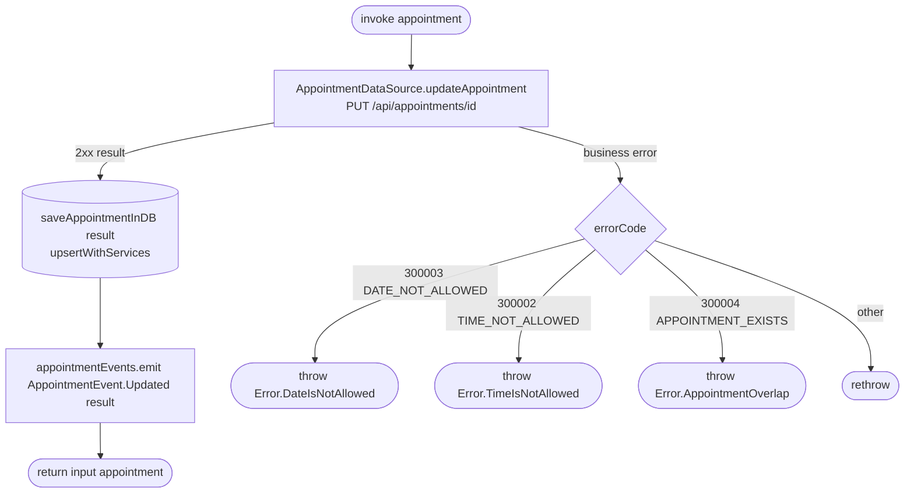

[← Operations](../README.md)

# Update appointment (reschedule)

`UpdateAppointment(appointment)` → `PUT /api/appointments/{id}`
· called from `AppointmentDetailsViewModel`

The server response is saved to the database and sent with the event, but the use case **returns the
input `appointment`** and not the server result. A caller that uses the return value sees the values it
submitted, not the server-normalized ones. The database and the event carry the server's version.

**Emits:** `AppointmentEvent.Updated`. **Consumed by:** `AppointmentListViewModel.reload()`, which refreshes the currently
selected date and the request count.
