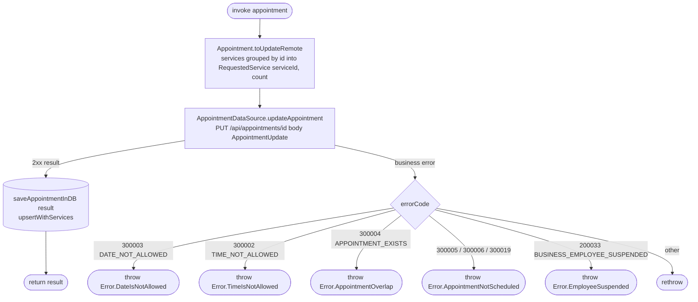

[← Operations](../README.md)

# Update appointment (reschedule)

`UpdateAppointment(appointment)` → `PUT /api/appointments/{id}`
· called from `AppointmentDetailsViewModel`

The body is an `AppointmentUpdate`, which carries only ids: `id` (#1), `date` (#8), `note` (#9),
`employeeId` (#13) and `services` (#14) as `RequestedService(serviceId, count)`. The proto numbers are
deliberately sparse because they match the fields of the backend `Appointment`. `Appointment.toUpdateRemote()`
builds `services` by grouping the appointment's service snapshots by id, since the backend stores one
snapshot per booked count, and keeps booking order. The backend keeps the stored client and business, and
keeps the stored price of every service that is already on the appointment.

The server response is saved to the database and returned.

```mermaid
flowchart TD
    Start([invoke appointment]) --> Map[Appointment.toUpdateRemote<br/>services grouped by id into RequestedService serviceId, count]
    Map --> Net[AppointmentDataSource.updateAppointment<br/>PUT /api/appointments/id body AppointmentUpdate]
    Net -- 2xx result --> Save[(saveAppointmentInDB result<br/>upsertWithServices)]
    Save --> R([return result])
    Net -- business error --> Code{errorCode}
    Code -- 300003 DATE_NOT_ALLOWED --> E1([throw Error.DateIsNotAllowed])
    Code -- 300002 TIME_NOT_ALLOWED --> E2([throw Error.TimeIsNotAllowed])
    Code -- 300004 APPOINTMENT_EXISTS --> E3([throw Error.AppointmentOverlap])
    Code -- 300005 / 300006 / 300019 --> E4([throw Error.AppointmentNotScheduled])
    Code -- 200033 BUSINESS_EMPLOYEE_SUSPENDED --> E5([throw Error.EmployeeSuspended])
    Code -- other --> EX([rethrow])
```
