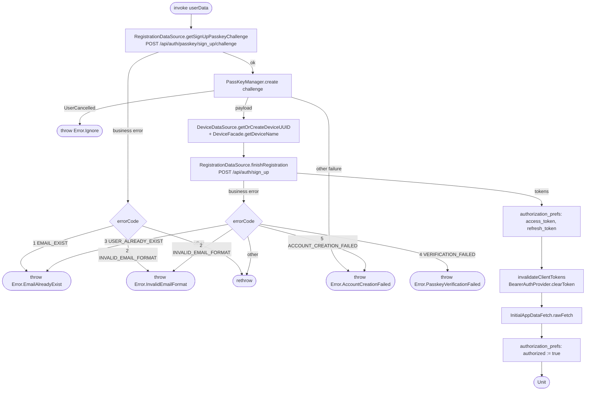

[← Operations](../README.md)

# Create account (passkey sign-up)

`CreateAccount(userData)` → `POST /api/auth/passkey/sign_up/challenge`, then `POST /api/auth/sign_up`
· called from `SignUpViewModel`

A three-step WebAuthn registration: the server issues a challenge, the platform `PassKeyManager` creates the
credential, and the server verifies it and returns tokens. After the tokens are saved, the Ktor bearer cache
is invalidated so the next request loads the new tokens. Then `rawFetch()` runs. `authorized = true` is
written **last**. That flag is what `BootstrapViewModel` observes to navigate into the app, so the main screen
opens with the profile and business list already cached.

Composes [Initial app data fetch](initial-app-data-fetch.md). A failure inside `rawFetch()` (for example
`GET /api/user/me`) propagates **after** the tokens are saved but **before** `authorized = true` is written. The
account exists and the tokens are stored, yet the app stays on the login screen.
