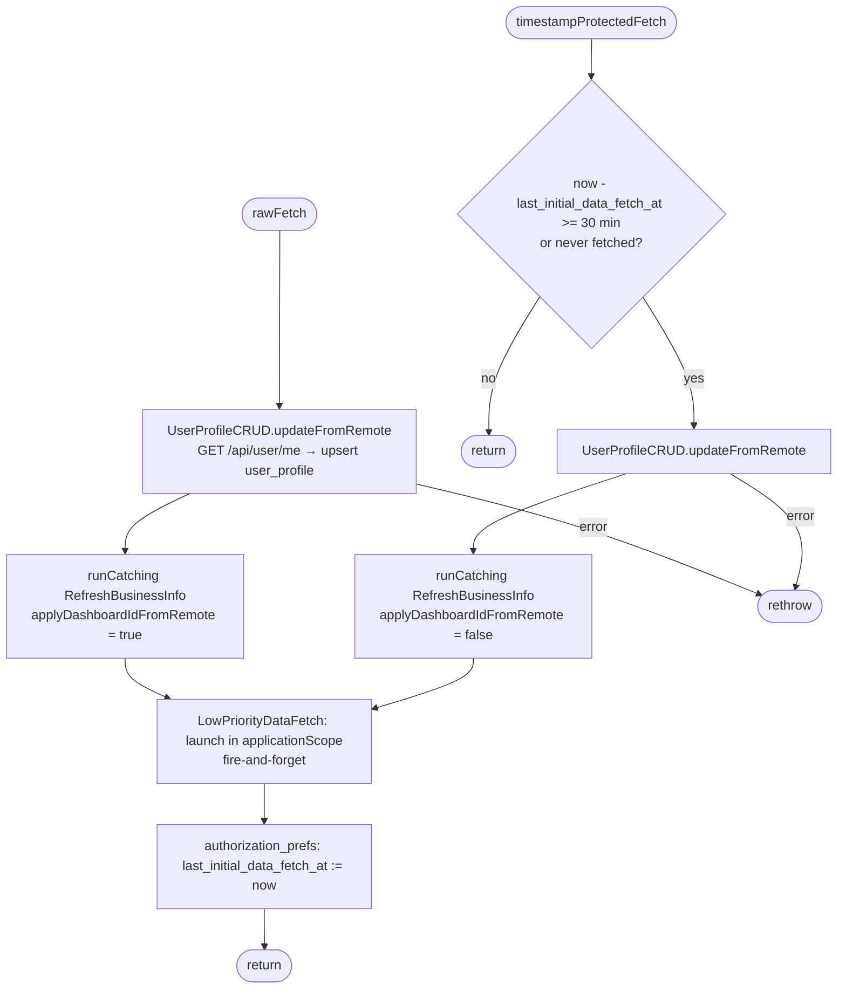
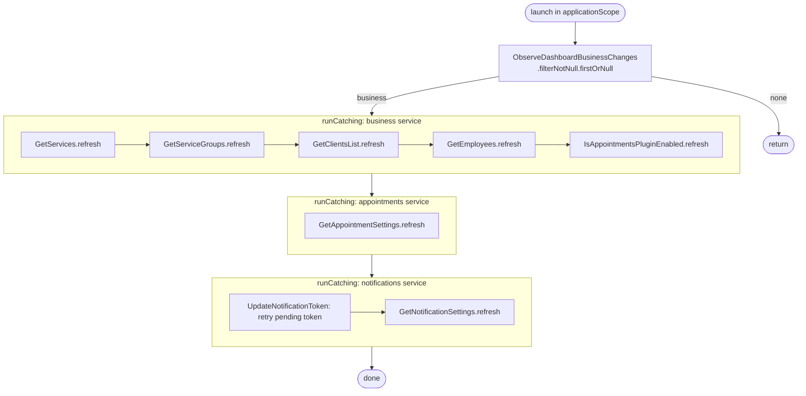

[← Operations](../README.md)

# Initial app data fetch (and low-priority data fetch)

`InitialAppDataFetch.rawFetch()` / `.timestampProtectedFetch()`
· `rawFetch` is called from [Sign in](sign-in.md) and [Create account](create-account.md).
`timestampProtectedFetch` is called from `BootstrapViewModel` on every app start.

It warms the cache so the first screens can render from Room. The two variants differ in one respect:
`rawFetch` always runs and **adopts the server's dashboard business selection**.
`timestampProtectedFetch` runs only when at least 30 minutes have passed since
`authorization_prefs.last_initial_data_fetch_at`, and it keeps the local selection.

The profile fetch is the only step that is **not** wrapped in `runCatching`. If it fails, the whole fetch fails
and the timestamp is not written.

## Low-priority data fetch

`LowPriorityDataFetch` (an internal class in `authorization/domain/impl`, not a public use case) runs in the
application scope, so it outlives the caller. It waits for the first non-null dashboard business and then
refreshes its data **one request after another**, which is intentional to avoid a burst of requests. The
requests are grouped by backend service so that one failing service does not block the others:

Within a group, the first failure skips the rest of that group. For example, if clients fail, employees and the
plugin flag are not refreshed on this run.
