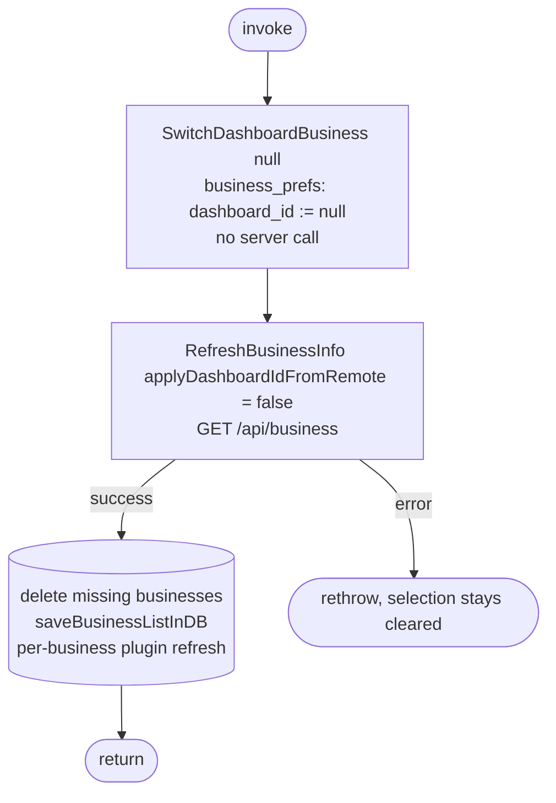

[← Operations](../README.md)

# Initiate business suspend

`InitiateBusinessSuspend()` → [Switch dashboard business](../business/switch-dashboard-business.md)`(null)`, then
[Refresh business info](../business/refresh-business-info.md) (`GET /api/business`)
· called from `BootstrapViewModel.onBusinessAccessSuspended()`, which the platform notification handlers invoke
when any screen posts `PresentationNotification.BusinessAccessSuspended`. That happens on an
`Error.BusinessAccessSuspended`, which is an HTTP 403 with `BUSINESS_EMPLOYEE_ACCESS_SUSPENDED` (200034).

A cross-feature wrapper that lets the authorization presentation layer react to a suspension without
depending on the business feature's domain API. It first clears the local dashboard selection
(`SwitchDashboardBusiness(null)` writes `dashboard_id := null` and skips the server call), then reloads every
business with `applyDashboardIdFromRemote = false`, so the cleared selection stays cleared and businesses the
user no longer has are deleted. With no dashboard business the dashboard switches to its Home tab (it does so
whenever its setup status goes from having a business to `NoBusiness`) and shows the Get started screen, which
lists the remaining businesses so the user can pick one. If the refresh fails, the selection stays cleared and
the list shows whatever is cached.

`BootstrapViewModel` shows the "Access suspended" message when the call starts and launches it keyed with
`LaunchBehaviour.DropLatest`: suspensions reported while one is still running are dropped, so a burst of 403s
yields one message and one refresh. A failure is only logged.

