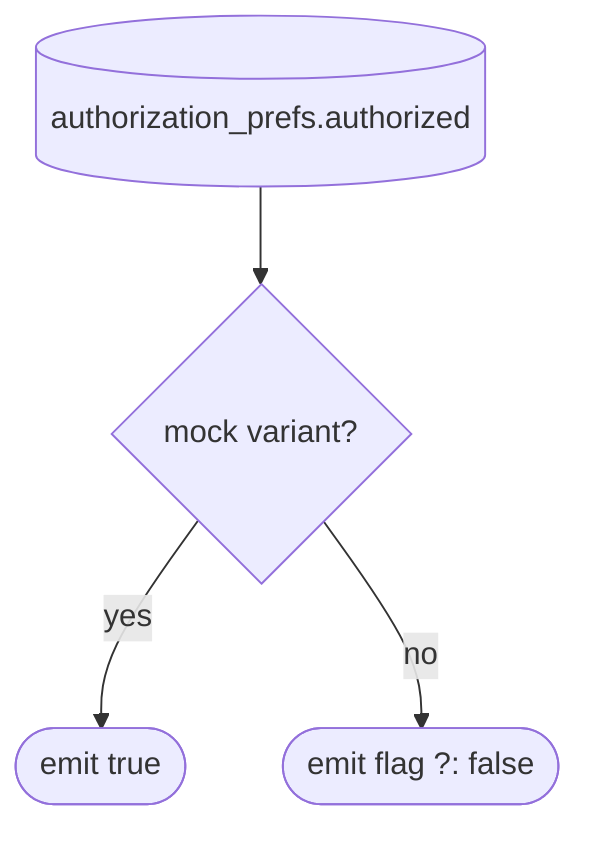

[← Operations](../README.md)

# Is user logged in / Get token info / Get settings color scheme

Three small read-only use cases in `authorization`, all **local only**.

| Use case | Reads | Caller |
|---|---|---|
| `IsUserLoggedIn()` | `access_token != null` | (unused) |
| `IsUserLoggedIn.asFlow()` | `authorization_prefs.authorized` (always `true` on `mock` variants) | `BootstrapViewModel`, which switches the root destination between `Main` and `Login` |
| `GetTokenInfo()` | `access_token` + `refresh_token`, or `null` if either is missing | Ktor `bearer { loadTokens / refreshTokens }` in `shared/.../NetworkDI.kt` |
| `GetSettingsColorScheme()` / `.asFlow()` | wraps `settings`' [GetColorScheme](../settings/get-color-scheme.md), mapped to `AuthColorScheme` | `BootstrapViewModel` (app theme) |

Note that "logged in" is driven by the `authorized` flag and **not** by whether a token exists.
[Sign in](sign-in.md) and [Create account](create-account.md) set the flag after the initial fetch,
[Delete account](../settings/delete-account.md) clears it, and [Log out](log-out.md) clears the whole bucket.

