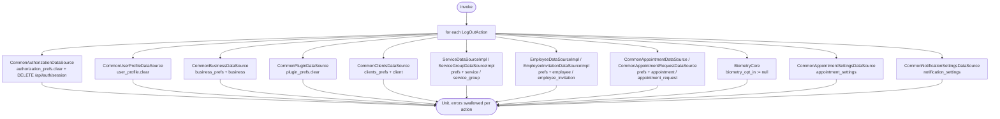

[← Operations](../README.md)

# Log out

`LogOut()` → calls `doOnLogOut()` on every Koin-bound `LogOutAction`
· called from `BootstrapViewModel.logOut()`, which the platform notification handlers invoke when any
screen posts `PresentationNotification.Unauthorized`. That happens on an `Error.Unauthorized`, which is an HTTP
401 that survived a token refresh, and on the Settings → Log out action.

Each action runs in its own `runCatching`, so one failure never blocks the rest. The actions run in Koin
registration order, which is not guaranteed. Clearing `authorization_prefs` flips `authorized` to false, and
`BootstrapViewModel` responds by navigating to Login.

`authorization_prefs.clear()` runs **before** `DELETE /api/auth/session`. The sign-out request therefore
goes out with whatever token the Ktor bearer cache still holds. If that request fails, the server session
stays open.

Not cleared: the `notification_prefs`, `device_prefs` and `settings_prefs` buckets. See
[preferences](../../database/preferences.md).
