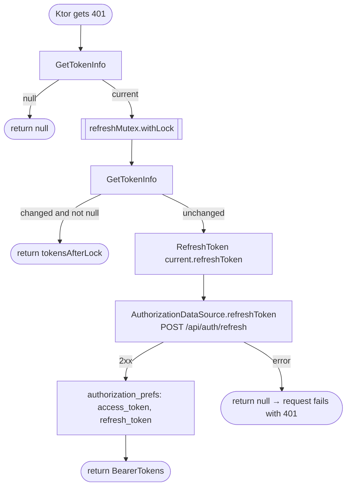

[← Operations](../README.md)

# Refresh token

`RefreshToken(refreshToken)` → `POST /api/auth/refresh` (unauthenticated client, `Authorization: Bearer <refresh>`)
· called only from the Ktor `bearer { refreshTokens { … } }` block in `shared/.../NetworkDI.kt`

The caller runs it under a `Mutex`. After taking the lock it re-reads the tokens, and if another request has
already refreshed them while this one waited, it reuses those tokens instead of refreshing again. If the refresh
fails, the block returns `null`. Ktor then passes the 401 on, the error maps to `Error.Unauthorized`, screens post
`PresentationNotification.Unauthorized`, and that leads to [Log out](log-out.md).

