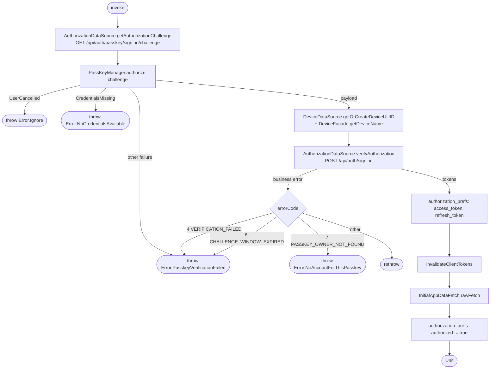

[← Operations](../README.md)

# Sign in (passkey)

`SignIn()` → `GET /api/auth/passkey/sign_in/challenge`, then `POST /api/auth/sign_in`
· called from `SignInViewModel`

It follows the same steps as [Create account](create-account.md) after the passkey step, and shares its
"`authorized` is written last" rule and its partial-failure behaviour.

