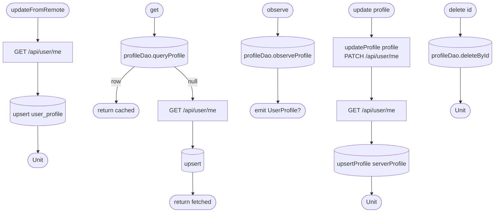

[← Operations](../README.md)

# User profile CRUD

`UserProfileCRUD` → `GET /api/user/me` / `PATCH /api/user/me`
· used by [Initial app data fetch](initial-app-data-fetch.md), [Create appointment](../appointments/create-appointment.md),
[Get settings](../settings/get-settings.md), [Edit profile](../settings/edit-profile.md) and
[Get notification settings](../settings/get-notification-settings.md)

`update` sends the edit once, then caches the server's copy of the profile (so server-side normalization
is what the app shows). `UserProfileDataSource.updateProfile` is network-only.
