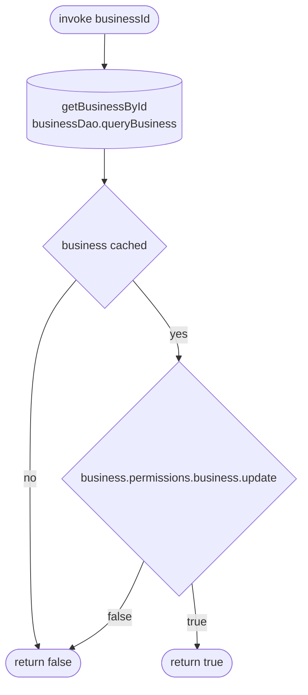

[← Operations](../README.md)

# Can edit business

`CanEditBusiness(businessId)` → local only · called from `BusinessPluginsViewModel`

Reads the cached `business` row via `BusinessDataSource.getBusinessById` and returns the current user's
`permissions.business.update` grant. A business that is not cached counts as "cannot edit".
`BusinessPluginsViewModel` sets `appointmentPlugin.canEnable` from the result, which shows the plugin's
"Enable" button only when it returns `true`.

