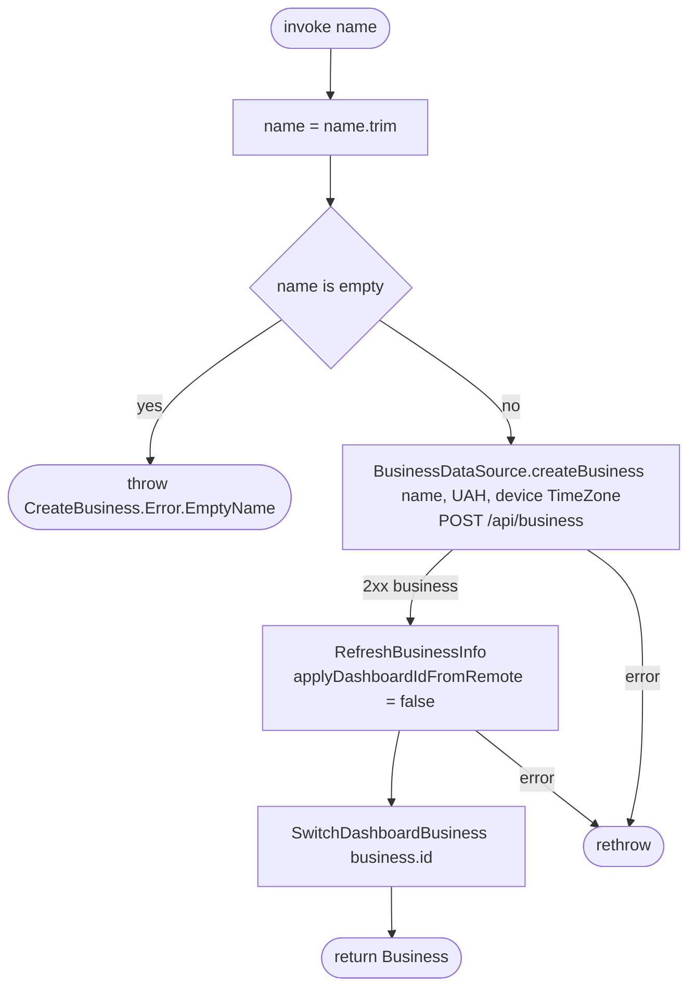

[← Operations](../README.md)

# Create business

`CreateBusiness(name)` → `POST /api/business`
· called from `BusinessDashboardViewModel` (business switcher) and `DashboardViewModel` (Home onboarding), each from a name input dialog

The name is trimmed first. A blank name throws `CreateBusiness.Error.EmptyName` before any network call.
The currency is **hard-coded to `"UAH"`** (a temporary placeholder in code) and the time zone is taken from the
device. The created business is not written to the database directly. Instead the use case re-syncs the whole
business list and then selects the new business, so the new row and its permission columns come from
`GET /api/business`.

Composes [Refresh business info](refresh-business-info.md) and [Switch dashboard business](switch-dashboard-business.md).
