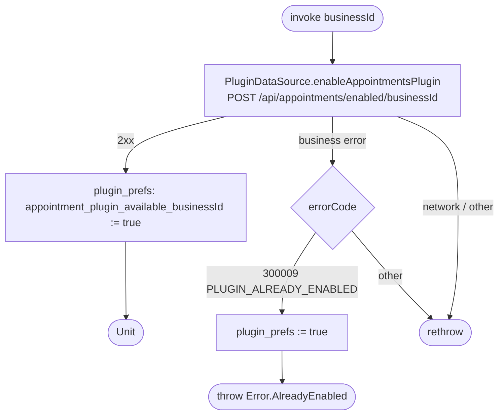

[← Operations](../README.md)

# Enable appointments plugin

`EnableAppointmentsPlugin(businessId)` → `POST /api/appointments/enabled/{businessId}`
· called from `BusinessPluginsViewModel`

Stores `true` in `plugin_prefs` / `appointment_plugin_available_<businessId>` both on success and when the
server says the plugin was already enabled. In the second case the local flag is corrected *before*
`AlreadyEnabled` is thrown. `IsAppointmentsPluginEnabled.flow` observes that key, so the dashboard shows the
Appointments tile either way.

Observed through [Is appointments plugin enabled](is-appointments-plugin-enabled.md) → [Get available dashboard features](get-available-dashboard-features.md).
