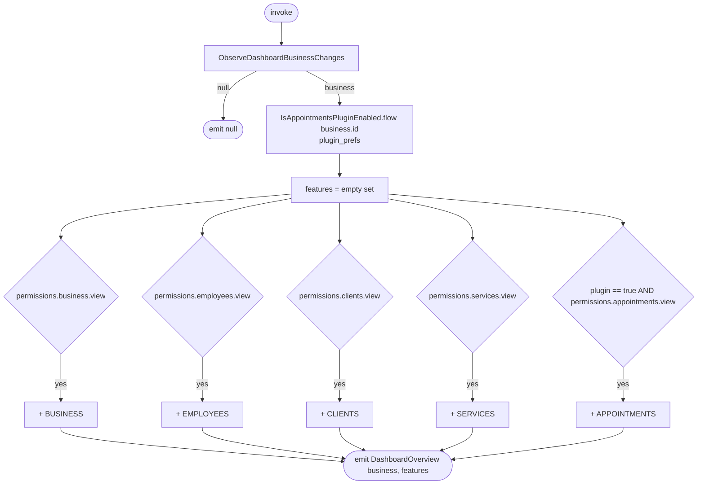

[← Operations](../README.md)

# Get available dashboard features

`GetAvailableDashboardFeatures()` → `Flow<DashboardOverview?>`, **local only**
· called from `BusinessDashboardViewModel`

Derives the set of dashboard tiles from the selected business's permission columns and the cached plugin
flag. It re-emits whenever the dashboard id, the business row, or the plugin preference changes.
`APPOINTMENTS` needs the plugin flag to be exactly `true`. `null` ("not fetched yet") hides the tile.

