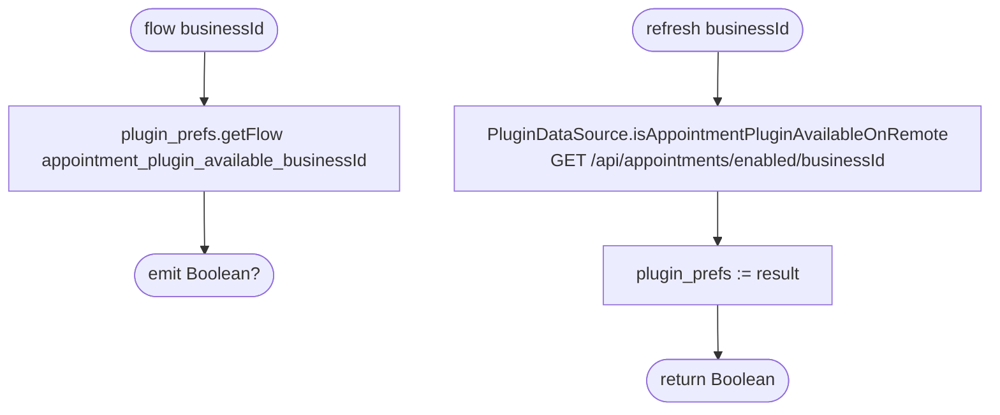

[← Operations](../README.md)

# Is appointments plugin enabled

`IsAppointmentsPluginEnabled.flow(businessId)` / `.refresh(businessId)` → `GET /api/appointments/enabled/{businessId}`
· called from `DashboardViewModel`, `BusinessPluginsViewModel`, [Refresh business info](refresh-business-info.md),
[Get available dashboard features](get-available-dashboard-features.md) and [low-priority data fetch](../authorization/initial-app-data-fetch.md)

A `Boolean?` stored in DataStore rather than Room. `null` means "never fetched" and is different from `false`.

