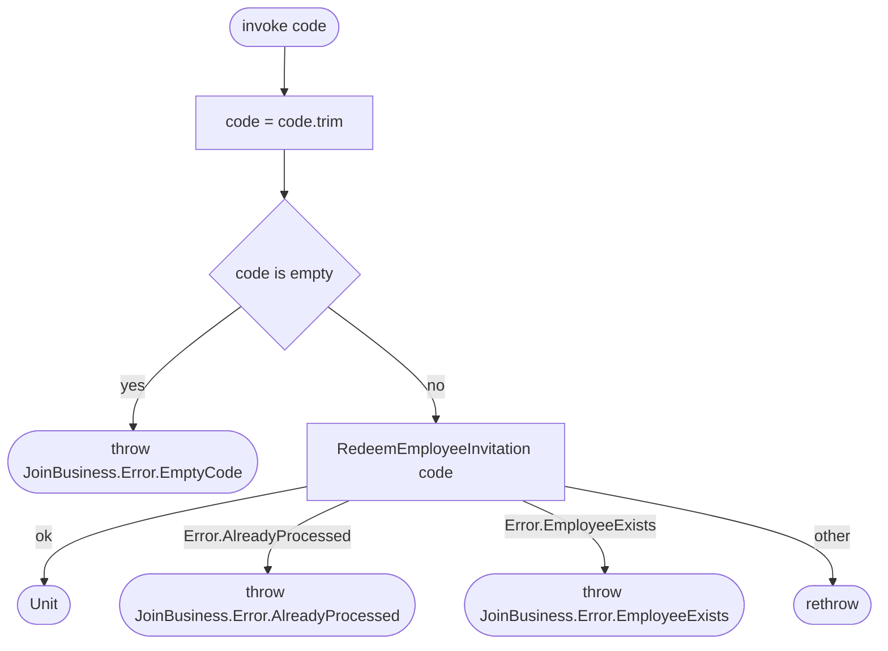

[← Operations](../README.md)

# Join business

`JoinBusiness(code)` → wraps `employees`' [Redeem employee invitation](../employees/redeem-employee-invitation.md)
· called from `BusinessDashboardViewModel` (business switcher) and `DashboardViewModel` (Home onboarding)

This wrapper exists so that `feature/business/presentation` never depends on `feature.employees.domain.api`
(see **Minimize cross-feature domain dependencies** in `AGENTS.md`). It trims the code, rejects a blank code locally with `JoinBusiness.Error.EmptyCode` without redeeming it, and
translates the error types.

