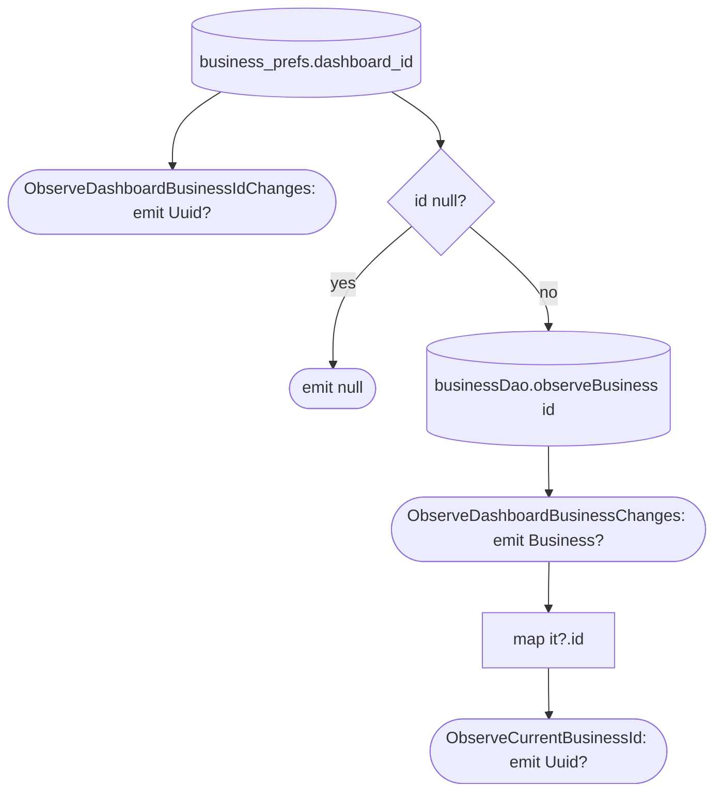

[← Operations](../README.md)

# Observe dashboard business (and its id)

The flows that every other feature uses to scope its data to the selected business. All three are
**local only**.

| Use case | Returns | Callers |
|---|---|---|
| `ObserveDashboardBusinessIdChanges()` (business) | `Flow<Uuid?>`: raw `business_prefs.dashboard_id` | none at the moment |
| `ObserveDashboardBusinessChanges()` (business) | `Flow<Business?>`: the id joined to its `business` row | `BusinessSettingsViewModel`, every `Get*.flow()` list, [Get available dashboard features](get-available-dashboard-features.md), [Observe dashboard setup status](observe-dashboard-setup-status.md), low-priority data fetch |
| `ObserveCurrentBusinessId()` (one copy each in appointments, clients, employees, services) | `Flow<Uuid?>`: `ObserveDashboardBusinessChanges().map { it?.id }` | list screens in those features |

`ObserveCurrentBusinessId` is copied per feature so that each feature's `presentation` only depends on its own
`domain/api`. It maps from the **joined business row**, not the raw id. Right after [Switch dashboard
business](switch-dashboard-business.md) to a business that is not cached yet, it emits `null` until [Refresh
business info](refresh-business-info.md) writes the row.

